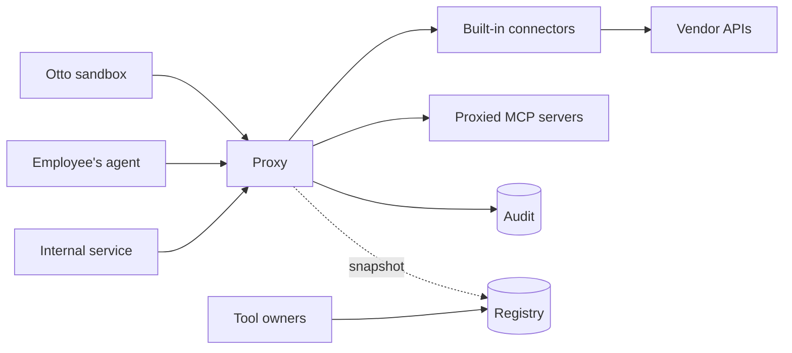

# MCP gateway design

Date: 2026-09-30. Status: draft. Q1–Q8 are settled. Proposed refinements and remaining
implementation decisions are in [open-questions.md](open-questions.md); they are not yet
accepted requirements.

## 1. Purpose

This is the one MCP path for TKWW. Every agent in the company, whoever runs it, reaches
tools through this gateway and nowhere else. The gateway proves who is calling, decides
whether the call is allowed, shows each caller only the tools it may use, attaches the
credential on the server side, and writes an audit row before it answers.

Otto, TKWW's platform for running agents in Kubernetes sandboxes, is one caller among several.
It is also the only caller with a working gateway today (`cmd/otto-gateway` in the
`agentrunner` repository, written in Go) and a written contract for how a gateway must behave.
This design takes the mechanisms from that contract and applies them company-wide, and keeps
Otto's stricter rules as policy for Otto's callers.

**Migration decision:** this gateway replaces Otto's Go MCP gateway. Otto will be reconfigured
to call it directly once the conformance suite passes. Until then, the Go gateway remains
Otto's MCP path. `/repo-config` and model brokering remain Otto responsibilities; their
separation from the existing gateway must be accounted for before cutover. See
[decision 0002](decisions/0002-replace-ottos-mcp-gateway.md).

### Sources

| Source | What this design takes from it |
| --- | --- |
| `agentrunner/docs/05-mcp-gateway.md` | Classification, the denial contract, proved against claimed identity, audit before answer, boot gates. |
| `agentrunner/docs/adr/0009-otto-builds-the-mcp-gateway.md` | Exactly one place decides authorization. |
| `agentrunner/docs/02-control-plane.md` | Policy tiers, approval design, action receipts and failover fencing. Receipts and fencing still need an explicit delivery decision here (Q10). |
| [DoorDash's Agent Gateway write-up](https://careersatdoordash.com/blog/how-doordash-built-a-centralized-gateway-for-ai-agent-tool-access/) | The registry and proxy split, curated tool surfaces, self-serve onboarding, several credential modes. |

The gateway component's synchronous audit-begin contract takes precedence here over the
control-plane document's asynchronous read-receipt proposal. Audit records and action receipts
serve different purposes; writing an audit record does not itself prevent duplicate effects.

## 2. Callers

| Caller | How it proves itself | Who it acts for | Status |
| --- | --- | --- | --- |
| Otto sandbox | Kubernetes ServiceAccount token, checked against the cluster's OIDC issuer. | A team (proved) and a human (claimed in a header). | Exists; served by the Go gateway today. |
| Employee's own agent, such as a coding assistant on a laptop | An access token for this gateway from the company identity provider, Okta. | That employee (proved). | Next after Otto. |
| Internal service or scheduled automation | A workload token from a configured, trusted issuer. | A team (proved). | After employees' agents. |

Agents hosted by outside vendors that would call in from the internet are deferred.

Employees connect through the company's private network or existing zero-trust access layer.
The laptop-facing deployment is separate from Otto's in-cluster deployment, sharing the
registry and audit store. The first clients, workflows and concrete access infrastructure
must be identified and tested before employee rollout (Q13).

## 3. Scope

### In scope

- Tools only: `initialize`, `ping`, `tools/list`, `tools/call`, over MCP's HTTP transport.
- Several identity issuers at once, one per caller type.
- Built-in connectors and proxied MCP servers behind one interface.
- A registry of servers, tools, owners, tool surfaces and policy.
- The systems listed in [systems.md](systems.md).
- Otto's security and behavioral contract, preserved for Otto's callers through conformance.
  Endpoint and tool-name changes are explicit migration mappings in Otto's configuration.

### Out of scope for now

- MCP resources, prompts and sampling.
- Servers that speak only stdio; they must be wrapped in an HTTP server first.
- Otto's `/repo-config` endpoint and model-call broker, which stay with Otto.
- Approval flows and capability grants.
- A registry UI. Configuration files come first, then an API.

## 4. Terms

| Term | Meaning |
| --- | --- |
| Caller | The process that sent the request. |
| Principal | What the gateway proved about the caller: a user, or a workload and its team. |
| Proved | Verified by the gateway from a signed token. |
| Claimed | Stated by the caller in a header, and not verified. |
| Profile | The policy set that applies to one caller type, such as Otto's. |
| Connector | Code that implements a group of tools against one external system. |
| Proxied server | A separate MCP server the gateway forwards to. |
| Classification | A tool's fixed label: `read`, `write` or `destructive`. |
| Tool surface | The named set of tools one endpoint exposes. |
| Brokering | The gateway attaches a credential on the server side; the caller never holds it. |

## 5. Architecture

- **Proxy (data plane).** Stateless. It handles every MCP request from an in-memory snapshot
  of the registry, so the registry is not on the request path. The audit store is on the
  request path, deliberately (section 11).
- **Registry (control plane).** The source of truth for servers, approved tools, owners, tool
  surfaces and policy. It starts as checked-in configuration files and becomes a Postgres
  service with an API when teams need to onboard without a pull request.

The proxy is built on `axum` with the `rmcp` SDK; see
[decision 0001](decisions/0001-build-on-axum-not-pingora.md).

### Proposed workspace layout

| Crate | Contents |
| --- | --- |
| `gateway-core` | Principals, classification, the decision function, the tool registry, the audit record type, denial sentences. No I/O. |
| `gateway-identity` | Token verifiers, one per issuer type, and the team manifest loader. |
| `gateway-audit` | The audit store over Postgres, and the explicit no-op store. |
| `connector-github` | GitHub App credential broker and tools. |
| `connector-proxy` | The connector that forwards to a separate MCP server. |
| `gateway` | The proxy binary: HTTP handler, boot gates, wiring. |
| `registry` | The control-plane binary, once it exists. |
| `conformance` | The black-box suite, a fake vendor API and a fake MCP server. |

## 6. The request path

Callers connect to `/mcp/{surface}`. Every `tools/call` goes through these steps in order:

1. **Verify the caller** against the issuer its token names, and resolve the principal.
2. **Compare claims with proof.** A claim that contradicts what was proved is refused.
3. **Select the profile** from the principal.
4. **Parse** the JSON-RPC message and look up the tool in the surface.
5. **Decide**, from the tool's classification and the profile's policy.
6. **Write the audit row.** If this fails, refuse the call.
7. **Run the tool** if allowed, with a brokered credential.
8. **Complete the audit row** with the outcome and latency.
9. **Answer.**

A denial at steps 1 to 5 still passes through step 6 before the caller reads it.
`tools/list` runs steps 1 to 5 for every tool in the surface and returns those that pass.

## 7. Identity

**Several issuers, one verifier interface.** Each configured issuer has a kind (Kubernetes
cluster, or company identity provider) and maps a verified token to a principal:

| Principal | Proved facts | From |
| --- | --- | --- |
| Workload | Subject, and the team the manifest maps it to. | A ServiceAccount token. |
| User | Subject and group memberships. | An identity-provider token. |

**Verification is strict and offline.** One signing algorithm, a key ID required, signing
keys fetched only from the issuer's own host, expiry and not-before checked with leeway,
audience membership required, and a ceiling on token lifetime.

**Verification has three states:** `proved`, `disabled` (checking was explicitly turned off)
and `failed`. An incident review must be able to tell "we were not checking" from "someone
tried and was refused".

**A wrong guess costs the same as a right one.** An unknown subject pays for the signature
check before it is refused, so response time does not reveal which subjects exist.

**Claims.** Otto sandboxes send the acting human and the team as headers. The team is checked
against the proved team. The human is recorded as a claim until Otto can prove it.

**Discovery for employees' agents.** The gateway publishes the metadata MCP's authorization
specification defines, so a standard client can find the identity provider and sign in without
per-user setup.

**What Rust adds.** Proved and claimed values get different types, for example
`Proved<TeamId>` and `Claimed<TeamId>`, and only a verifier can construct a `Proved`. Code
that needs a proved team cannot be handed a header value by mistake.

## 8. Policy

Policy has two layers, evaluated by one function.

**Classification, company-wide.** Every tool has exactly one classification. A tool with none
never runs; there is no default.

**Profile rules, per caller type.** Classification, proved versus claimed identity, the denial
contract, audit before execution or ordinary denial, and fail-closed enforcement apply to all
profiles. Production mutation is denied for every profile initially.

| Rule | Otto profile | Employee profile | Service profile |
| --- | --- | --- | --- |
| Reads | Allowed. | Within the user's groups and approved data access; see section 9. | Allowed, within the team's surfaces. |
| Writes | Proposal-shaped only. | Only explicitly approved tools; per-user grants where authorship or permissions require them. Broader write policy remains Q9. | Proposal-shaped only. |
| Destructive | Never. | Denied initially; future expansion needs a separate decision and approval design. | Never. |
| Acting as a named user | Never. | Allowed through a gateway-held per-user grant where needed. | Never. |

**Which surfaces a principal may use** is an allowlist: teams and groups against surfaces.
Default deny.

**What Rust adds.** The registry accepts a classification type that can only be built by a
conversion that fails for anything unrecognized, and a destructive tool can be held only in a
type the Otto profile's run path does not accept. An enum also has no unset state, which
removes the zero-value case the Go gateway has to guard against.

## 9. Credentials

The caller never receives a downstream credential. Each connector or proxied server has one
or more credential modes:

| Mode | Who holds the credential | Used for |
| --- | --- | --- |
| Team service identity | The gateway, per team. | Otto and services. The default. |
| Gateway-held token | The gateway, one for everyone. | Read-only systems with no per-team distinction. |
| Per-user grant | The gateway, encrypted, per user. | Employees' agents where vendor permissions or authorship require it; introduced system by system. |
| Minted short-lived credential | Issued by the gateway to the caller. | CLI-shaped tools such as `aws`. The one exception to "the caller never holds a credential". |

Shared identities may serve employee reads only when the data they expose is explicitly
approved for those employees. Read-only credentials do not establish that permission.
Where a shared identity would expose additional data, the integration requires a per-user
grant or remains unavailable to that employee. Initial employee rollout includes only
integrations that meet this rule; a required grant is a prerequisite, not a deferred safeguard.

## 10. The denial contract

Every refusal is a sentence a model can act on, never a bare status code or a stack trace.

- **Named refusals** say exactly what disagreed: the unknown tool, the classification rule, or
  both the proved and the claimed team. They go only to callers that have proved who they are.
- **Opaque refusals** use one fixed sentence for every identity failure. Which check failed is
  logged for operators and never returned.
- **An audit failure** produces a third sentence, distinct from both.

## 11. The audit record

One row per call, denials included.

- **Begin before the work.** The row is written before the tool runs and before a denial is
  returned. For a denial, that row is the complete record.
- **Finish after.** Outcome and latency are filled in once the tool returns, on a deadline
  separate from the caller's request, so a disconnecting client cannot leave an outcome empty
  on a call that completed.
- **An empty outcome is evidence** that the gateway allowed the call and never learned what
  happened.
- **Audit failure fails closed.** If the row cannot be written, the call is refused.
- **Proved and claimed are separate columns.**
- **No foreign key to anything a caller owns,** so a caller's data retention cannot delete its
  audit trail.

This puts Postgres on the path of every call for the whole company. Its availability becomes
the gateway's availability, and that is an accepted cost of the rule.

For Otto's callers the row must match the existing `gateway_audit` table.

**What Rust adds.** The begin step returns a guard value that the tool-running code requires
as an argument, so a call path that skips the audit write does not compile.

## 12. Boot gates

Checked before a socket is bound. Identity and audit each have four states:

| | Configured | Explicit opt-out only | Neither | Both |
| --- | --- | --- | --- | --- |
| Identity | Starts; callers must prove themselves. | Starts with a loud warning. | Refuses to start. | Refuses, as a contradiction. |
| Audit | Starts; every call recorded. | Starts with a loud warning. | Refuses to start. | Refuses, as a contradiction. |

A partly configured gate is refused. A connector that is partly configured refuses to start; an
unconfigured one is absent from every surface.

## 13. Connectors and proxied servers

A connector lists its tools with their classifications and runs a call given a verified
context. There are two implementations, and [systems.md](systems.md) says which each target
system is likely to use.

**Built-in connectors** are gateway code calling a vendor API. The GitHub connector is the
model: it brokers a GitHub App token, limits every call to one organization before any request
leaves, bounds result sizes, and tags every result as external evidence.

**Proxied servers** are onboarded through the registry:

1. An owner registers the server: address, credential mode, owning team.
2. The registry reads the server's tool list.
3. A person assigns each tool a classification and approves it. A server is never trusted to
   classify its own tools.
4. Each approval records a hash of the tool's name, description and input schema.
5. Approved tools are added to tool surfaces.

**Drift.** The registry re-reads each server's tool list on a schedule. A tool whose
definition no longer matches its hash is withdrawn from every surface until it is approved
again. A description is text an agent reads as guidance, so a changed description is a changed
interface and a possible attack.

**Descriptions shown to agents** are the approved ones, never the live ones.

**The caller's token is never forwarded** to a proxied server. The gateway presents its own
credential for that server.

## 14. Tool surfaces

A surface is a named set of approved tools from any number of connectors and servers, served
at one URL. Tools are exposed as `{system}__{tool}` so names cannot collide and the route is
recoverable from the name; names stay within 64 characters of letters, digits, `_` and `-`.

Small surfaces matter for two reasons: an agent cannot call what it cannot see, and agents
choose better from a short list.

If a proxied server is down, `tools/list` returns the rest of the surface and records the
failure.

## 15. Sessions

The gateway keeps no client-facing MCP session. It issues no session ID and every request
carries its own token, so any instance can answer any request. Upstream sessions to proxied
servers that need one are a per-instance cache that can be rebuilt. Sessions must be isolated
by server, credential identity and authorization context. Rebuilding a session does not
authorize replaying a write whose outcome is unknown; recovery behavior is part of Q10.

## 16. Invariants

A change that weakens one of these is wrong even if every test passes.

1. **This gateway is the only place that decides authorization for tool calls,** and the
   decision is one function.
2. **No caller holds a downstream credential,** except a minted short-lived one issued
   deliberately.
3. **A caller's own token is never sent downstream.**
4. **A tool with no classification or no approval never runs.**
5. **No answer without an audit row.**
6. **Proved and claimed are never the same value, type or column.**
7. **Identity failures are indistinguishable to the caller,** in content and in cost.
8. **An unconfigured security gate refuses to start.**
9. **An approval binds to an exact tool definition.**
10. **Content from external systems is data,** tagged as such, never instructions.
11. **The whole request path runs with no real credential,** against fakes.

## 17. Delivery milestones

Otto comes first because it has a working gateway to compare against and a written contract.
The third column says what covers for a behavior before its milestone.

| Milestone | Turns on | Stands in until then |
| --- | --- | --- |
| 1. Skeleton | The endpoint; `initialize`, `tools/list`, `tools/call`; tool registry and decision function; a canned fixture tool; named denials; boot gates. The conformance suite, passing against the Go gateway first. | — |
| 2. Identity | The verifier interface with the Kubernetes issuer; team manifest; proved against claimed; opaque refusals. A local test issuer for user tokens. | Identity explicitly disabled by flag. |
| 3. Audit | Begin and finish; fail closed. | Audit explicitly disabled by flag. |
| 4. GitHub connector | Token brokering, the five existing tools, organization limits, evidence tagging. Otto could now switch over. | The canned fixture. |
| 5. Proxied servers | The proxy connector against one self-built server; file-based registry; approval, hash pinning and withdrawal; tool surfaces. | Built-in connectors on one surface. |
| 6. Employees' agents | Okta as an issuer; user principals and group policy; client discovery metadata; private network reachability from laptops; per-user grants for any launch integration that requires them. | The local test issuer. |
| 7. Operations | Per-team rate limits and circuit breakers; registry as a service with an API; drift polling on a schedule. | No limits; registry in files. |
| Later | Internal services and scheduled automations; the remaining systems and their required per-user grants; minted AWS credentials; approval flows; a registry UI. | Not built. |

Milestone 6 depends on access to Okta, which TKWW's IT owns. That request has the longest lead
time in the plan and should be sent before milestone 1 starts.

## 18. Testing

The initial Go baseline is executable in [conformance/](../conformance/README.md).
Its [observed behavior](otto-baseline.md) records discrepancies with this draft and future
Otto promises. These findings inform Q9–Q13; they are not silent changes to the desired design.

- **The conformance suite is the Otto contract in executable form.** It sends HTTP requests
  and compares responses and audit rows. It must pass against the Go gateway before any Rust
  exists, which proves it describes real behavior. Endpoint and tool-name mappings for the
  Rust gateway are explicit in the suite and in Otto's migration configuration; those mappings
  do not relax the security or behavioral assertions.
- The suite lives in this repository and runs against a pinned `agentrunner` commit.
  Existing-behavior conformance and new company-wide behavior have separate test groups.
- Each invariant in section 16 gets a test that is shown to fail when its guard is removed.
  Where the guard is a type, the test is a compile-fail test.
- Audit tests use a real Postgres. Everything in `gateway-core` is tested with no database.

## 19. Proposed refinements

The accepted architecture stays in place. Before implementation, resolve Q9–Q13 in
[open-questions.md](open-questions.md): resource-level authorization, audit completion and
safe retries, bounded policy staleness, earlier operational protections, and concrete client
compatibility. The current request path and milestone table do not yet include those proposed
changes. Vendor feasibility and AWS issuance-to-action auditing remain research work in
[systems.md](systems.md).
