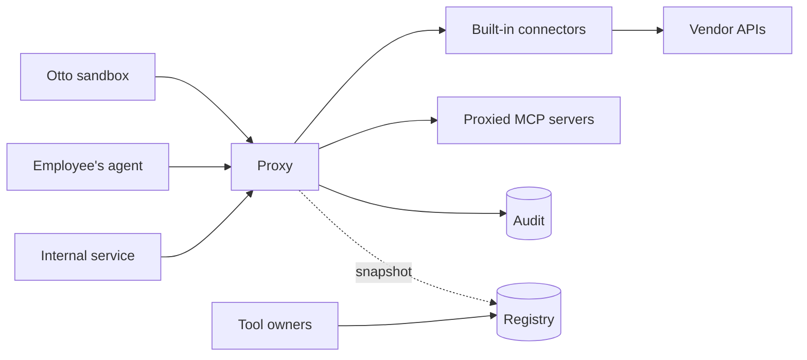

# MCP gateway design

Date: 2026-09-30, revised 2026-10-01 against Otto `752395a` and after an independent design
review, 2026-10-04 and 2026-10-06 for the classifications in section 8, and 2026-10-07 for
decisions 0009 (audit and receipts), 0010 (routes around the gateway), 0011 (resource
authorization and tool assurance) and 0012 (turn grants). Status: draft.
Settled questions and the ones still open are in
[open-questions.md](open-questions.md); open ones are not yet accepted requirements.

## 1. Purpose

This is the one MCP path for Org: every agent the gateway serves is offered it as its path to
tools. The gateway proves who is calling, decides
whether the call is allowed, shows each caller only the tools it may use, attaches the
credential on the server side, and writes an audit row before it answers.

"The one path" is a property of the environments agents run in, not of this service alone. It
holds only where three controls hold: nothing provisioned to the agent holds or yields a
credential for a target system; the agent reaches target systems and self-built MCP servers
only through the gateway; and each self-built server the gateway proxies accepts only the
gateway's credential. Each environment that serves agents carries one of two claims, "the only
path" or "the governed path", shown by evidence from inside it; employees' laptops are the
governed path. See [decision 0010](decisions/0010-what-stops-an-agent-going-around-the-gateway.md)
and [route-exceptions.md](route-exceptions.md).

This is built to find out what such a gateway looks like, without a comparison against
extending Otto's gateway or adopting an existing one first; see
[decision 0005](decisions/0005-build-without-a-comparison-first.md).

Otto, Org's platform for running agents in Kubernetes sandboxes, is one caller among several.
It is also the only caller with a working gateway today (`cmd/otto-gateway` in the
`otto` repository, written in Go) and a written contract for how a gateway must behave.
This design takes the mechanisms from that contract and applies them company-wide, and keeps
Otto's stricter rules as policy for Otto's callers.

**Otto is one piece of this gateway, not its shape.** The core (identity, policy, audit,
credentials, connectors, proxied servers, tool surfaces and the registry) is written for every
caller and knows nothing about Otto. What is specific to Otto is confined to three places: a
policy profile, a delegation verifier for its turn grants, and a client for the interface
through which Otto supplies facts only it knows. Otto's endpoints, tables and release cadence
stay in Otto. Otto's contract decides when Otto can switch over. It does not decide what the core looks like, and it does
not hold up the rest of the company's path.

**Migration decision:** this gateway replaces Otto's Go MCP gateway, in stages: run alongside
it and compare, then take reads, then writes, then retire the Go gateway's MCP path. Until
each stage, the Go gateway remains Otto's path. Otto keeps its model broker and its
control-plane endpoints (`/repo-config`, `/pr-receipt`, `/pr-outcome`); when those endpoints
need something done in a vendor system, Otto's control plane asks this gateway to do it. See
decisions [0002](decisions/0002-replace-ottos-mcp-gateway.md) and
[0003](decisions/0003-otto-keeps-its-control-plane-endpoints.md).

### Sources

| Source | What this design takes from it |
| --- | --- |
| `otto/docs/05-mcp-gateway.md` | Classification, the denial contract, proved against claimed identity, audit before answer, boot gates. |
| `otto/docs/adr/0009-otto-builds-the-mcp-gateway.md` | Exactly one place decides authorization. |
| `otto/docs/02-control-plane.md` | Policy tiers, approval design, action receipts and failover fencing. Receipts: [decision 0009](decisions/0009-audit-completion-receipts-and-recovery.md). Fencing: [decision 0012](decisions/0012-what-a-turn-grant-binds.md). |
| [DoorDash's Agent Gateway write-up](https://careersatdoordash.com/blog/how-doordash-built-a-centralized-gateway-for-ai-agent-tool-access/) | The registry and proxy split, curated tool surfaces, self-serve onboarding, several credential modes. |

The control-plane document's asynchronous read-receipt proposal was not taken. Every tool
call has one synchronous path: begin before the tool runs, finish before the answer (section
11). Audit rows and action receipts serve different purposes. An audit row records one attempt
and does not prevent a duplicate effect; a receipt is what stops the gateway making one.

## 2. Callers

| Caller | How it proves itself | Who it acts for | Status | Claim (decision 0010) |
| --- | --- | --- | --- | --- |
| Internal service or scheduled automation | A workload token from a configured, trusted issuer. | A team (proved). | First: the first slice serves a mock one, then a real one. | The mock workload in kind: the only path to the mock server, once the kind run's evidence is current. A real workload: the governed path until the route check passes in its own namespace, which it must before it sees real data. |
| Otto sandbox | Kubernetes ServiceAccount token, checked against the cluster's OIDC issuer, plus a signed per-turn grant from Otto's control plane. | A team (proved from the token) and a human (attested by the control plane in the grant). | Exists; served by the Go gateway until its staged cutover. | The governed path. No turn has the only path while Otto's Go gateway serves any tool through its MCP path. After that, a sealed turn rises to the only path once its evidence exists and the audit row tells it from a turn with egress open. |
| Otto control plane | A workload token for a subject that is not a sandbox. | Otto itself, performing vendor actions for its own endpoints. | With Otto's cutover. | None: not an agent. |
| Employee's own agent, such as a coding assistant on a laptop | An access token for this gateway from the company identity provider, Okta. | That employee (proved). | After Otto. | The governed path. |

Agents hosted by outside vendors that would call in from the internet are deferred, and CI
runners are not served. Serving either would start with the governed path.

Employees connect through the company's private network or existing zero-trust access layer.
The laptop-facing deployment is separate from Otto's in-cluster deployment, sharing the
registry and audit store. The first clients, workflows and concrete access infrastructure
must be identified and tested before employee rollout (Q13).

## 3. Scope

### In scope

- Tools only, over MCP's HTTP transport: `tools/list` and `tools/call` in both revisions,
  `server/discover` in the newer one, and `initialize` and `ping` in the older one.
- Several identity issuers at once, one per caller type.
- Built-in connectors and proxied MCP servers, presented the same way to callers and held
  to different levels of assurance (section 13).
- A registry of servers, tools, owners, tool surfaces and policy.
- The systems listed in [systems.md](systems.md).
- Surfaces restricted to named workload subjects.
- Otto's security and behavioral contract, preserved for Otto's callers through conformance.
  Endpoint and tool-name changes are explicit migration mappings in Otto's configuration.

### Out of scope for now

- MCP resources, prompts and sampling.
- Servers that speak only stdio; they must be wrapped in an HTTP server first.
- Otto's model-call broker and control-plane endpoints, which stay in Otto.
- Human approval of individual calls, and grants of a capability to perform one specific
  action. Approval of a tool for a surface, turn grants and per-user grants are different
  things and are in scope.
- A registry UI. Configuration files come first, then an API.

## 4. Terms

| Term | Meaning |
| --- | --- |
| Caller | The process that sent the request. |
| Principal | What the gateway proved about the caller: a user, or a workload and its team. |
| Proved | Verified by the gateway from a signed token. |
| Claimed | Stated by the caller in a header, and not verified. |
| Profile | The policy set that applies to one caller type, such as Otto's. |
| Connector | Code that implements a group of tools against one external system. |
| Proxied server | A separate MCP server the gateway forwards to. |
| Classification | A tool's fixed label: `read`, `propose`, `write` or `destructive` (section 8). |
| A write | Any call that changes something: a `propose` tool or a `write` tool. Written as code, `write` is only the classification for direct writes. Receipts and recovery (decision 0009) apply to every write. |
| Tool surface | The named set of tools one endpoint exposes. |
| Brokering | The gateway attaches a credential on the server side; the caller never holds it. |

## 5. Architecture

- **Proxy (data plane).** Any instance can serve any request and an instance can be replaced
  at any time, but it is not stateless: it holds a registry snapshot, upstream session caches
  and audit completions still in flight. `tools/list` is answered from the snapshot's approved
  definitions, so neither the registry nor a proxied server is on that path. The audit store
  is on the request path, deliberately (section 11).
- **Registry (control plane).** The source of truth for servers, approved tools, owners, tool
  surfaces and policy. It starts as checked-in configuration files and becomes a Postgres
  service with an API when teams need to onboard without a pull request.

The proxy is built on `axum`, with the MCP endpoint written by hand behind a small protocol
adapter; see decisions [0001](decisions/0001-build-on-axum-not-pingora.md) and
[0007](decisions/0007-serve-two-mcp-revisions-from-a-hand-written-endpoint.md). It serves MCP
revisions `2026-07-28` and `2025-06-18` on one endpoint, without sessions in either. The
`rmcp` SDK is used only in tests, as a client.

### Proposed workspace layout

This is where the code is expected to end up. It starts as fewer crates, split along these
lines only once the interfaces between them have settled.

| Crate | Contents |
| --- | --- |
| `gateway-core` | Principals, classification, the decision function, the tool registry, the audit record type, denial sentences. No I/O. |
| `gateway-identity` | Token verifiers, one per issuer type, and the team manifest loader. |
| `audit-postgres` | The audit store over Postgres: the schema, its two roles, the migrations and the boot check. |
| `connector-github` | GitHub tools, and the client for the key custodian. |
| `otto-adapter` | Otto's policy profile, the turn-grant verifier and the client for Otto's resolver interface. The core crates do not depend on it. |
| `connector-proxy` | The connector that forwards to a separate MCP server. |
| `gateway-registry` | The registry file: approved tool definitions, surfaces, profiles, limits and profile selection, loaded into a core snapshot. |
| `gateway-mcp` | The MCP protocol adapter: JSON-RPC envelopes, the two revisions, header checks, rendering. No policy types. |
| `gateway` | The proxy binary (`switchboard`): HTTP handler, boot gates, the deployment file, wiring, registry reload. |
| `gateway-dev` | The gateway on the test fakes (`switchboard-dev`), a scripted client, and the end-to-end tests. |
| `mock-docs-server` | A mock document server that plays a proxied MCP server in tests and the demo. Shares no code with the gateway. |
| `demo-checks` | Tests for the demo's scripts and manifests in `deploy/`. No code of its own. |
| `registry` | The control-plane binary, once it exists. |
| `conformance` | The black-box suite, a fake vendor API and a fake MCP server. |

## 6. The request path

Callers connect to `/mcp/{surface}`. Every `tools/call` goes through these steps in order:

1. **Verify the caller** against the issuers configured for this deployment, and resolve the
   principal. A token naming any other issuer is refused; a token never chooses where keys
   are fetched from.
2. **Verify any delegation the request carries,** whether or not the profile requires one; the
   verifier needs no profile. For Otto this is the turn grant: its version, key, canonical
   encoding, signature, audience, lifetime and, once required, pod are checked. The verifier
   does not deny. A delegation that cannot be verified is passed on as unverified, carrying the
   kind of failure and, for a grant whose signature verified, its digest, and step 5 denies it
   at check 3 with a single reason kind of its own. That holds under a profile that does not
   require a delegation too: check 3 denies any delegation that is present and unverified. A
   grant that verifies but names a team other than the proved team is denied at check 3 too,
   naming both teams.
3. **Select the profile** from the issuer, the deployment and the principal.
4. **Parse** the JSON-RPC message and look up the tool in the surface.
5. **Decide**, by the checks of
   [decision 0006](decisions/0006-what-the-decision-function-sees.md) as amended, in this
   order, the first that fails giving the reason:
   - check 0, the profile exists; check 1, the surface is permitted to the principal; check 2,
     the tool is approved on the surface;
   - check 3, a delegation is present where the profile requires one, and any delegation that
     is present is verified and agrees with the principal;
   - check 4, the delegation lists the tool;
   - check 5, the profile permits the classification. `write` and `destructive` are denied
     before the profile is read, except a tool named in the profile's list of excepted tools
     once #12 builds it (decision 0011);
   - the currency check, under a profile that requires it, such as the profile for Otto's
     sandboxes: a call of a tool not classified `read` needs Otto's answer that the turn is
     current (decision 0012);
   - check 6, each named resource is within the caller's limit;
   - the key check, last: a call of a tool not classified `read` that carries no key is denied
     (decision 0009), so a caller is asked for a key only when the call would otherwise be
     allowed.
6. **Write the audit row.** The gateway assigns the row a UUIDv7 first. Begin has a budget,
   within which it is retried by that identifier. For a side effect, the receipt is reserved
   in the same transaction, and a reused key is answered there without running anything. If
   begin fails or its budget runs out, refuse the call.
7. **Check the arguments,** for a proxied tool, against its approved input schema, read as
   JSON Schema 2020-12. A schema in another dialect is refused or converted at approval. Where
   an object in the schema lists its properties, any other property is refused, at any depth.
   The gateway forwards its own serialization of the arguments, never the caller's bytes. A
   call that fails is completed with outcome `error`, and nothing is forwarded. A built-in
   connector parses the arguments into its own types instead. Either way, a side effect whose
   arguments are refused has its receipt settled as `not_performed` with the row.
8. **Run the tool** if allowed, with a brokered credential. The connector, the credential
   layer and the custodian may still refuse, never allow. A connector may refuse because of
   what the call names, such as a repository outside the team's scope. The gateway bounds the
   result's size and duration above any bound of the connector's own. A result over the bound
   is never cut short silently: for a `read` tool it is outcome `error`, and for any other tool
   it is `unknown` (decision 0009).
9. **Complete the audit row** with the outcome (`ok`, `error`, `refused`, `unknown` or
   `duplicate`) and latency. The answer waits for this for at most the answer budget, and
   finish keeps retrying until its deadline.
10. **Answer.** A connector's refusal whose completion is not confirmed within the answer
   budget gets the audit-failure sentence, which is still true: nothing ran.

Steps 6 to 9 run on a task of their own, started before begin, so a client that disconnects
cannot cancel a write to the store. A disconnect before the connector is called stops the
call. A disconnect during a read cancels it. A side effect runs to its call deadline.

A failure at step 1, and a body that cannot be parsed, are telemetry events and do not pass
through step 6 (section 11). Steps 2 and 3 deny nothing, and step 4 refuses only a body it
cannot parse, as telemetry. A denial at step 5 still passes
through step 6 before the caller reads it, so an unverifiable delegation is a deny row.
`initialize`, `ping` and `server/discover` produce telemetry.

`tools/list` runs steps 1 to 5 for every tool in the surface and returns those that pass. It
decides with no resources and no key, and skips check 6, the currency check and the key check.
A `propose` tool is listed to a caller who may call it and denied on `tools/call` without a
key. It writes one row of kind `list`, complete, naming the tools returned. This is
deliberately stricter than Otto's Go gateway, which lists every served tool even under a grant
that permits only some; whether Otto's callers rely on that is checked when Otto's adapter is
built.

## 7. Identity

**Several issuers, one verifier interface.** Each deployment has a fixed list of issuers and
audiences. Each issuer has a kind (Kubernetes cluster, or company identity provider) and maps
a verified token to a principal, which is identified by issuer and subject together:

| Principal | Proved facts | From |
| --- | --- | --- |
| Workload | Subject, and the team the manifest maps it to, and, for a pod's token, the pod UID once the verifier exposes it (milestone 4). | A ServiceAccount token. |
| User | Subject and group memberships. | An identity-provider token. |

**Verification is strict and offline.** One signing algorithm, a key ID required, signing
keys fetched only from the issuer's own host, expiry and not-before checked with leeway,
audience membership required, and a ceiling on token lifetime.

**Keys can change without a restart.** At boot each issuer's keys are read once, from the file
the deployment names. The identity gate can also replace one configured issuer's keys while it
runs: it builds a whole new verifier with the new set, which gets every check a set gets at
boot, and puts it in force only if that succeeds. A refused set leaves the keys in use. The
caller names the issuer; nothing in a token chooses whose keys are replaced, and keys for an
issuer that is not configured are refused. Nothing in the gateway fetches keys or calls the
replacement yet.

**Verification has three states:** `proved`, `disabled` (checking was explicitly turned off) and
`failed`. An incident review must be able to tell "we were not checking" from "someone tried and
was refused". "We were not checking" is a row with identity `disabled`. For identity, "someone
tried and was refused" is a telemetry event (section 11); for a delegation, it is a deny row.
The core cannot yet record a row with identity `disabled`, so until it can, the built path
refuses every `tools/call` with identity disabled and lists nothing, with no row (section 17).

**A wrong guess costs the same as a right one.** An unknown subject pays for the signature
check before it is refused, so response time does not reveal which subjects exist.

**Delegations.** A delegation is a signed statement from a trusted control plane about whom a
workload is acting for. Otto's is the turn grant: its control plane mints one per turn, naming
the session, turn, execution, team, acting human, fencing epoch, expiry and the tools that
turn may call. The sandbox presents it and cannot alter it. The acting human is therefore
attested by Otto's control plane; it is still not proof that the person pressed a key, and the
audit record keeps it in the claimed columns.

Otto signs grants with a shared secret today, so any verifier can also mint. Otto is asked to
sign them asymmetrically so this gateway holds only a public key; see
[decision 0004](decisions/0004-verify-turn-grants-with-a-public-key.md). A control plane that
delegates to this gateway signs with a key the gateway cannot use to sign.

What a grant binds is [decision 0012](decisions/0012-what-a-turn-grant-binds.md). Its issuer is
fixed by the Ed25519 key that verifies it, one key per Otto environment. `aud` lists the gateway
deployments it is for, two during the cutover. `iat` and `exp` bound its lifetime to at most 15
minutes, with 30 seconds of leeway. `pod` binds it to the sandbox pod's UID, by stage 3 at the
latest. `egress` carries the turn's egress setting, which is recorded (decision 0010). Within
those bounds a grant may be presented any number of times, and every row records its digest, so
reuse from another pod, or another deployment sharing this gateway's audit store, is one query.
A call of any tool not classified `read` is also checked for currency: Otto's resolver says
whether the turn is still current, which enforces the fencing epoch and lets Otto revoke one
turn. Reads are not fenced. The Kubernetes verifier is to expose the pod UID its token proves,
and the principal to carry it; neither does yet (section 17).

**Discovery for employees' agents.** The gateway publishes the metadata MCP's authorization
specification defines, so a standard client can find the identity provider and sign in without
per-user setup.

**What Rust adds.** Proved and claimed values get different types, for example
`Proved<TeamId>` and `Claimed<TeamId>`, and only a verifier can construct a `Proved`. Code
that needs a proved team cannot be handed a header value by mistake.

## 8. Policy

Policy has two layers. One function decides from who is calling, which tool and the resources
the call names; what can be known only while the tool runs is checked by the connector, and
both land in one audit record
([decision 0011](decisions/0011-resource-authorization-and-tool-assurance.md)).

**Classification, company-wide.** Every tool has exactly one classification, assigned by the
person who approves it. A tool with none never runs; there is no default.

| Classification | Meaning |
| --- | --- |
| `read` | Reads and changes nothing. |
| `propose` | Creates something for a person to review, or changes only what the gateway itself created for review: a draft pull request, an issue it opens, a commit to its own proposal branch, a comment on something it created for review. Nothing it does takes effect until a person acts on it. |
| `write` | Changes something directly: a merge, a push to a branch the gateway did not create for a proposal, a status transition, a configuration change, a comment on anything the gateway did not create for review. |
| `destructive` | Destroys something. |

A comment is `propose` only when it is on something the gateway itself created for review,
such as its own draft pull request or an issue it opened. A comment anywhere else is `write`,
because a comment can take effect on its own: a bot reads `/deploy` or `atlantis apply` as a
command, and a comment can trigger CI. The rule is about what the comment is on, not that
thing's state: a comment on the gateway's own pull request is still `propose` after a person
marks it ready for review, if its tool makes the guards below.

The decision function sees only the classification, not what the gateway created. A tool is
`propose` only if it refuses, when it runs, to act on anything the gateway did not create, by
a check such as the author being the gateway's own identity, a reserved branch prefix, or a
fact from Otto's resolver. A tool that cannot make that check is `write`.

Acting only on what the gateway created is not enough. A comment on the gateway's own pull
request can still be a command. So a `propose` tool must also guard, when it runs, against
anything that would take effect without a person acting. A guard is either a refusal or a
value the tool forces. Otto's tools show the cases. `github_pr_comment` refuses a comment whose
first word Atlantis would read as a command, on any pull request. `github_create_pr` forces a
draft, because the org's Atlantis plans every pull request that is not a draft, on a server
holding an AWS role. `github_amend_change` refuses to commit to a pull request a person has
marked ready for review, because Atlantis would plan the new commit.

A refusal is recorded as the outcome `refused`. A forced value is not a refusal: the call
completes with the outcome `ok`, and what it created is a draft. A `propose` tool has no
setting that turns a guard off. Otto has one, `CreateReadyPRs`, an operator flag that makes
`github_create_pr` open pull requests that are ready for review. It is not carried over; a
create-PR tool with such a setting is `write`.

The bots whose commands a comment tool refuses are named when the tool is approved: those
configured for the repositories or projects it can reach. Today that is Atlantis. CI cannot
be refused by what starts it: a draft pull request, a push to the gateway's proposal branch and
a comment each start the workflows configured for them. That is acceptable where those workflows
only build and test. Whether a proposal stays `propose` in a repository where a workflow that a
pull request, a push or a comment starts can deploy or holds a production credential is open
(Q9). It waits on the owners of Atlantis, CI and Jira automation. Until they answer, only
automation already named, which today is Atlantis comment commands, makes a tool `write`. A
proposal tool stays `propose` on the position above, and also refuses changes to CI workflow
files and to Atlantis configuration
([decision 0011](decisions/0011-resource-authorization-and-tool-assurance.md)). A proposal
that changes ordinary code or `.tf` files can still start an Atlantis autoplan, or a pull
request workflow that runs with the repository's secrets. That stays unguarded until then.

A change to something that exists, such as amending a proposal or editing a comment, is
`propose` only if the connector checks that the gateway created it for the same principal:
from the gateway's receipts, or from a delegating control plane's resolver. Without one of
them it is not `propose`. Decision 0009 goes further: no `propose` tool is served at all
until a receipt store is configured.

The guards are made by the connector, so the decision function cannot watch them. Each one,
the forced draft included, is tested like any other guard: the tool's connector has a test
against the fake vendor that fails without it, and a mutation that removes it (section 18).

Under this rule Otto's `github_pr_comment` and `jira_comment` are `write`: they comment on
pull requests and issues the gateway did not create. So is `addOrEditJiraIssueComment` on
Atlassian's hosted server, which [systems.md](systems.md) plans for the Jira surface. The owner
allowed Otto's two tools to Otto's callers by a narrow, recorded exception
([decision 0011](decisions/0011-resource-authorization-and-tool-assurance.md), section 9).
It is in the profile for Otto's sandboxes only, which requires currency, so each call is also
fenced (decision 0012); the profile for Otto's control-plane surface has no exception, and the
loader refuses an exception list on a profile that does not require currency. The tool refuses
the commands of the bots named when it is approved, today Atlantis; it reaches only the team's
repositories or the configured Jira projects; every call is audited; and it is listed in the
register of exceptions that decision 0010 keeps, with this project as its owner, accepted by
the owner, and to be signed by a named security owner, who has not yet been named. It is
reviewed every 90 days and before each milestone's rollout, so before milestone 4, when it
first comes into force, and when Otto's cutover (#13) completes. `addOrEditJiraIssueComment`
gets no exception, because it can edit other people's comments. The core has no way yet to
express the exception. Under #12, check 5 itself changes: it denies `write` and `destructive`
unless the tool is named in the calling profile's list of excepted tools, and an allowed call
records the exception that allowed it in a field of its own, not as a reason. The list names
tools, never a classification. The exception comes into force only once #12 has built it and
the security owner has signed its entry. Until then Otto's callers are denied both tools,
which loses parity with Otto's gateway.

**Profile rules, per caller type.** Classification, proved versus claimed identity, the denial
contract, audit before execution or ordinary denial, and fail-closed enforcement apply to all
profiles. `write` and `destructive` are denied in every profile by the decision function, so
no profile's data can permit them as a classification. That is how production mutation is
denied for every profile initially: anything that changes production without a person acting
is one of the two. The one exception is the recorded one for Otto's two comment tools, above,
which names tools in the profile for Otto's sandboxes and needs a change to check 5.
Permitting direct writes needs a decision that replaces part of
[decision 0006](decisions/0006-what-the-decision-function-sees.md). This binds calls through
the gateway. Where an environment's claim is the governed path, it says nothing about other
routes ([decision 0010](decisions/0010-what-stops-an-agent-going-around-the-gateway.md)).

| Rule | Otto profile | Employee profile | Service profile |
| --- | --- | --- | --- |
| Reads | Allowed. | Within the user's groups and approved data access; see section 9. | Allowed, within the team's surfaces. |
| Proposals (`propose`) | Allowed. A comment is a proposal only on something the gateway created for review, such as its own draft pull request or an issue it opened, and only if its tool refuses the commands of the bots named when it was approved. | Only approved tools on employee surfaces, always under the employee's own per-user grant, once that system's grant and receipts work (decision 0011). None at launch. | Allowed, with the same limit on comments. |
| Direct writes (`write`) | Never, except Otto's two comment tools under the profile for Otto's sandboxes, by the recorded exception above, once it is in force (#12). | Denied in every profile. Permitting them needs a decision replacing part of decision 0006. | Never. |
| Destructive | Never. | Denied initially; future expansion needs a separate decision and approval design. | Never. |
| Acting as a named user | Never. | Allowed through a gateway-held per-user grant where needed. | Never. |

**Which surfaces a principal may use** is an allowlist: teams and groups against surfaces.
Default deny. A surface can also be restricted to named workload subjects, each surface with
its own set. That is how the vendor actions Otto's control plane performs are kept away from
sandboxes.

**A delegation can narrow further.** For an Otto turn, a tool the surface serves is still
refused unless the turn's grant lists it. A grant only narrows: check 4 runs before check 5,
so a grant that lists a `write` tool is still denied, unless the exception decision 0011
records for Otto's two comment tools names it. Under the profile for Otto's sandboxes a call
of any tool not classified `read` also needs a current control plane
([decision 0012](decisions/0012-what-a-turn-grant-binds.md)).

**How a tool's resources are found** is stated in its approval, in one of four ways
([decision 0011](decisions/0011-resource-authorization-and-tool-assurance.md), section 1):

- **From the arguments.** The tool's adapter, gateway code, reads them from structured
  arguments, and the decision function checks each against the caller's limit.
- **As the reach.** The adapter names its connector entry's whole recorded reach on every call,
  whatever the arguments, and the decision function checks that.
- **Checked while running.** Only a built-in connector may do this, for scope that cannot be
  known before the tool runs, such as which repositories a code search returns. The call's
  resources are `unknown` and the connector refuses at run time.
- **None.** The tool reaches nothing a limit applies to.

A resource outside the limit, or none where the tool declares some, is a denial. A run-time
refusal is recorded as the outcome `refused` on an allowed row, as is a `propose` tool's
refusal of something the gateway did not create or of something that would act on its own.
"What did the gateway refuse" is therefore a denial or a refused outcome.

**One function is the only place that can allow a call.** The receipt check at begin, the
argument check, the connector, the credential layer, the custodian and the vendor may each
refuse or fail after it, and none may allow. One audit record holds the whole decision for a
call, and its policy revision identifies the approvals and loader checks the call relied on.

**Broad reads use a breadth resource.** A read that shows more than its caller could otherwise
see, such as AWS inventory across accounts, takes the accounts as a structured argument. A call
that names none names the breadth resource instead, such as `aws / organization / o-example`,
and is allowed only for teams and groups whose limit lists it. Opting in is adding that
resource, or the accounts, to a limit, approved by the data's owner and a security reviewer.
Check 6 enforces it on any surface, so the tool needs no surface of its own and there is no
breadth field. A broad read with free-form arguments, such as the AWS MCP Server's `call_aws`,
is not exposed.

**Gateway policy and vendor permissions.** Both must allow, and each can only narrow what the
other allows. The gateway decides which caller may use which tool, on which surface, for which
resources, under which classification, with which credential. The vendor decides what that
credential may do, including inside a resource the gateway does not see, such as Jira issue
security levels and Confluence page restrictions. A vendor permission never stands in for a
gateway rule: a read-only credential does not make a tool `read`, and a person's admin rights
do not permit a `write` tool. Examples of each case are in
[decision 0011](decisions/0011-resource-authorization-and-tool-assurance.md), section 8.

**What Rust adds.** The registry accepts a classification type that can only be built by a
conversion that fails for anything unrecognized. An enum also has no unset state, which
removes the zero-value case the Go gateway has to guard against. A tool runs only with a
guard that only an allow from the decision function produces, and code that skips either
does not compile.

An earlier version of this section said a destructive tool could be held only in a type the
Otto profile's run path does not accept. That was not built, and it has been dropped. Every
profile shares one run path, so a type per profile would need a run path per profile, and the
rule is about every profile, not Otto's. Instead the decision function refuses a `write` or
`destructive` tool before it reads the profile. That is a runtime check, and tests watch it:
a property that such a tool is never allowed or listed, decision-table cases for each
profile, and mutations that remove each half of the check
([decision 0006](decisions/0006-what-the-decision-function-sees.md), amended 2026-10-04).

## 9. Credentials

The caller never receives a downstream credential. Each connector or proxied server has one
or more credential modes:

| Mode | Who holds the credential | Used for |
| --- | --- | --- |
| Team service identity | The gateway, per team. | Otto and services. The default. |
| Gateway-held token | The gateway, one for everyone. | Read-only systems with no per-team distinction. |
| Per-user grant | The gateway, encrypted, per user. | Employees' agents where vendor permissions or authorship require it; introduced system by system. |
| Minted short-lived credential | Issued by the gateway to the caller. | CLI-shaped tools. No listed system needs it now that Otto plans AWS as brokered tools; kept as a named mode, not built. An environment served this way cannot have the only path claim (decision 0010). |

**Long-lived keys sit in a custodian, not in the gateway process.** Otto moved its GitHub App
key into a separate process that only exchanges it for short-lived tokens, so a compromised
gateway cannot take the key itself. The gateway still holds the short-lived tokens, and a
compromised gateway can still ask for more. So the custodian checks each request against
what that team and tool may ask for, limits the rate and lifetime, and keeps its own record.
Where a vendor supports workload federation or its own short-lived credentials, that is
preferred to holding a key at all.

**Tokens are narrowed per call where the vendor allows it.** Otto requests GitHub tokens
limited to the proved team's repositories, and its accepted direction is one repository per
write.

**Connector entries.** Each credential is registered as a connector entry with exactly one
mode ([decision 0011](decisions/0011-resource-authorization-and-tool-assurance.md), section
1). A system reached in two modes, with a service account per team, or with several
permission sets has several entries. The entry records its narrowing:
`call`, a token narrowed to the resources the call names; `limit`, narrowed to the caller's
limit; or `none`. Otto's GitHub tokens are `limit` today, and GitHub names at most 500
repositories in one token, so a larger request is refused, not cut short. A proxied entry, or
one serving a tool whose resources are its reach, also records that reach and the dated test
that showed it holds. A call runs only on the credential its approval names. There is no
fallback from one mode to another.

Shared identities may serve employee reads only when the data they expose is explicitly
approved for those employees. That approval is the group's resource limit. It approves whole
resources, such as a Jira project or a Confluence space, not content restricted inside them:
a shared credential serving employees must be unable to see such content, shown by a
restricted canary in its test. Read-only credentials do not establish that permission. Where
a shared identity would expose additional data, the integration requires a per-user grant or
remains unavailable to that employee. Initial employee rollout includes only integrations that
meet this rule; a required grant is a prerequisite, not a deferred safeguard. Every employee
proposal runs on the employee's own per-user grant.

The custodian checks token requests against its own copy of what each team and tool may ask
for. That copy is generated from the same policy files as the snapshot, and each token request
carries the policy revision it was decided under.

## 10. The denial contract

Every refusal is a sentence a model can act on, never a bare status code or a stack trace.

- **Named refusals** say exactly what disagreed: the unknown tool, the classification rule, or
  both the proved and the claimed team. They go only to callers that have proved who they are.
- **Opaque refusals** use one fixed sentence for every identity failure. Which check failed is
  logged for operators and never returned. The opaque sentence is returned even during an
  audit outage, since an identity failure writes no row.
- **An audit failure** produces a third sentence, distinct from both.
- **A delegation that cannot be verified** gets one fixed sentence, whatever was wrong with it.
- **Receipts** have sentences of their own: the outcome is unknown and the call must not be
  repeated; one for each answer to a reused key (section 11); a key reused with a different
  tool-use identifier; and a side effect sent without a key, asking for one.
- **Currency** has two: a side-effecting Otto call whose turn is not current, and one whose
  currency could not be confirmed ([decision 0012](decisions/0012-what-a-turn-grant-binds.md)).

The row's identifier is returned in the result's `_meta`, or in `error.data` for a JSON-RPC
error, so a person reporting a problem can quote it.

## 11. The audit record

What an audit row guarantees, how rows are recovered and how receipts stop a side effect being
made twice are settled by
[decision 0009](decisions/0009-audit-completion-receipts-and-recovery.md). Its "Still open"
list names what others must still decide.

**Three records.**

| Record | Covers | Written | If it cannot be written |
| --- | --- | --- | --- |
| Telemetry | Requests that reach no decision: a token that does not prove a principal, a body that cannot be parsed, an accepted notification, a transport refusal (method, protocol headers, size, host or origin), `initialize`, `ping` and `server/discover`. Also every audit or receipt write that failed. | Structured events and counters, off the request path, through a bounded queue. Drops are counted. | Lost. Nothing waits for it. |
| Audit row | Every request that reaches a decision, from a proved principal or with identity checking explicitly disabled: each `tools/call`, allowed or denied, including one whose delegation could not be verified; and each `tools/list`. | Postgres, before the tool runs and before any answer. | The call is refused with the audit-failure sentence. |
| Receipt | Each allowed side effect: a call to any tool not classified `read`. | Postgres, in the same transaction as the call's begin. | The call is refused. |

The exceptions to invariant 5 are the requests telemetry covers, which reach no decision, and
the fixed answer given when the row itself cannot be written. A telemetry event for an identity
failure records the claimed issuer and subject, escaped and capped, and never the token.

A row of kind `call` records one call. A row of kind `list` records one `tools/list`: the
policy revision and the names of the tools returned, at most 64 with the rest counted. It is
written complete, has no finish, and is never open.

- **Begin before the work.** The gateway gives each row a UUIDv7 before begin, and begin and
  finish are idempotent on it. When begin returns, the row is committed. Begin has a budget,
  which includes waiting for a connection, and is retried by identifier within it. The row
  records the instance, the database's time at begin, and a deadline: that time plus the
  begin budget, the call deadline and the finish deadline. A `BEFORE INSERT` trigger sets both
  times from the database's clock and the allowance the gateway supplies, and the deadline
  cannot be empty. For a denial, the row is the complete record. A begin reported as failed may
  still have committed. The instance knows nothing ran, so it completes such a row as `error`,
  retrying until the finish deadline; only one it cannot complete reads as open. A row can
  overstate what ran, never understate it.
- **Finish after the tool, before the answer.** Finish writes only the completion columns and
  completes a row at most once. The first completion stands, and the same one written again is
  success. The answer waits for finish for at most the answer budget and then goes out
  regardless, because withholding the result of a call that already happened invites a retry.
  Finish keeps retrying by identifier until the finish deadline, on a small connection pool of
  its own. A finish not written by then is a telemetry event naming the row, and never holds
  the result.
- **A call runs on a task of its own,** started before begin, not on the request's future
  (section 6).
- **Five outcomes,** as decision 0009 states them:
  - `ok`: the call completed.
  - `error`: the call failed, with a kind: invalid arguments, an oversized or late result from
    a `read` tool, a custodian refusal, a vendor refusal, or another failure. How a vendor
    refusal is recognized is defined per connector. A side-effecting connector reports `error`
    only when it knows the vendor did nothing.
  - `refused`: a refusal after the decision that can never allow: a connector's scope refusal,
    a `propose` tool's refusal (section 8), the credential layer's refusal, such as an employee
    with no grant, or the receipt check's refusal of a reused key. Nothing was sent.
  - `unknown`: a side effect sent with no definite answer, including a result over the
    gateway's bound from a tool not classified `read`. A read never reports it. A proxied
    tool's error is `unknown` unless its approval says its errors are safe.
  - `duplicate`: nothing ran because the same request was already completed.

  For a side effect, `ok` settles the receipt as `completed`, `error` and `refused` as
  `not_performed`, and `unknown` as `unknown`. A call answered by the receipt check reserves
  no receipt of its own and leaves the earlier one as it is.
- **The caller's tool-use identifier is recorded,** so a caller's control plane can look up
  the decision for a call it already knows about. Otto's does. The MCP specification defines
  no such identifier: Claude Code sends `claudecode/toolUseId` in `_meta`, and other clients
  may send none.
- **The resources a call names are recorded,** so "who reached this repository" can be
  answered from the rows, for allowed calls as well as denials. The row holds what the call
  named, not only what the decision checked: a call denied before the resource check still
  records them. A tool that checks its own scope may record `unknown` here, until it reports
  what it reached (below). A row that counts omitted resources cannot rule a resource out, so
  a query for who reached one must treat such rows as possible matches.
- **Recorded resources are bounded,** because the caller chooses them through its arguments.
  Each resource is kept once, in the order first named, so repeating one cannot push another
  off the row. A row keeps at most 64 and counts the rest, and the resource a denial names is
  always kept. Each value is escaped so that it can be read back: a backslash is escaped too.
  A system and a kind are capped at 128 characters, like the tool name. An identifier is
  capped at 2,048, the longest an AWS ARN can be, so that each identifier length checked in
  [systems.md](systems.md#identifier-lengths) fits whole. Only AWS, MongoDB, Sumo Logic,
  Confluence and GitHub were checked, and a self-built server's identifiers have no
  documented bound. Escaping lengthens non-ASCII text, so an identifier with much of it can
  still be cut; a cut value ends with `…`.
- **A row's recorded resources are at most 147,648 characters:** 64 resources, each with a
  129-character system and kind and a 2,049-character identifier, the `…` included. That
  counts the escaped values, not what a store writes. JSON escapes a value's backslashes and
  quotes again, so as JSON they reach 297,675 characters, or 298,059 bytes, since `…` takes 3
  bytes. Any call that gets a row can reach this, a denial included, and the row is written
  before the tool runs. The size limits and audit latency targets in Q12 must cover a row this
  large, counted as the store counts it.
- **Audit failure fails closed.** If the row cannot be written, the call is refused.
- **A row is the record, or there is no row.** A store that cannot hold a value exactly refuses
  the record rather than store another value in its place, and the call is refused. Postgres
  text and jsonb cannot hold U+0000, and a caller chooses its tool-use identifier and the
  values it claims, so the Postgres store refuses a record with U+0000 in any text value,
  naming the column, and a refusal sentence with one at finish. It refuses a latency or a
  count past its `bigint` column the same way.
- **Proved and claimed are separate columns.**
- **No foreign key to anything a caller owns,** so a caller's data retention cannot delete its
  audit trail.
- **Rows show what went through the gateway.** Where an environment's claim is the governed
  path, they show who reached a resource through the gateway, not everyone who reached it
  ([decision 0010](decisions/0010-what-stops-an-agent-going-around-the-gateway.md)). For
  Otto's callers, the row records the turn's egress setting once the turn grant carries it.
- **The recorded resources say how they were found**
  ([decision 0011](decisions/0011-resource-authorization-and-tool-assurance.md)): named by the
  call, or the reach of the tool's connector entry. A reach is recorded by reference to the
  entry, not as a list, since it can hold more resources than a row keeps and the policy
  revision says exactly what it was.
- **The credential identity used is recorded:** the mode and the vendor-side principal, never
  the secret.
- **A tool that checks its own scope reports what it reached** when it finishes, in place of
  `unknown`. This is required before milestone 4.
- **A turn grant is recorded by what identifies it:** its digest (the SHA-256 of the grant as
  presented), issuer, key ID, the pod UID, the turn's egress setting and, for a call of a tool
  not classified `read`, Otto's currency answer. A grant that fails verification is denied at
  check 3 as an unverified delegation. Its row records which check failed and no claims, and,
  if its signature verified, its digest.
- Otto's `gateway_audit` table has none of these. They stay in this gateway's own record unless
  Otto adds them. Whether it does is part of the question about that table in Q12.

**Open rows.** Nothing writes to a row except begin and finish, and nothing marks it
afterwards. What a row of kind `call` means follows from its columns and the database's clock:

| Decision | Outcome | Deadline | Meaning |
| --- | --- | --- | --- |
| deny | empty | — | The complete record of a denial. Nothing ran. |
| allow | set | — | What the gateway learned. |
| allow | empty | not passed | In flight, or its finish is still being retried. |
| allow | empty | passed | Open. The gateway never learned what happened. For a side effect, the receipt settles which. |

An empty outcome means no outcome was durably recorded and is never a sign that a call is safe
to repeat. Open rows are found by a query, counted and exported; alerting waits until paging is
decided. A finish that arrives after the deadline is still written. Rows are never edited by
hand: a person's finding about a row or a receipt is a resolution record, appended and never
changed.

**What the database enforces.** On the audit table, the gateway's role inserts every column
except the times, which a trigger sets. It selects only the identifier, kind, decision,
deadline and completion columns, and updates only the completion columns. It cannot delete, and
it cannot read who called what on the audit table. A trigger refuses any update to a completion
already set, so "at most once" holds in the database. The receipt table has grants and a
trigger of its own. The same role reads receipts, which the reuse check needs, so it can read
who caused each side effect, on which tool and where. Deletion for retention uses a separate
role (Q12). None of this protects rows against a database superuser.

**Shutdown.** On termination an instance first fails its readiness check, then stops accepting
calls, and lets running calls and their finishes complete. Its termination grace period is set
explicitly, longer than the readiness-removal delay plus the begin budget, the call deadline
and the finish deadline.

**Signals,** counted and exported from milestone 2: begin failures and the audit-failure
answers they cause; answers released before finish; finishes not written by their deadline;
open rows; receipts in `unknown` and the age of the oldest; begin and finish latency;
connections in use per pool; telemetry dropped. Alert thresholds and paging are set before the
first production deployment.

The provisional values are two seconds for the begin budget, two seconds for the answer budget
(as in Otto) and thirty seconds for the finish deadline. Call deadlines are set per tool. Q12
sets the final values.

This puts Postgres on the path of every call for the whole company. Its availability becomes
the gateway's availability, and that is an accepted cost of the rule. The first slice
measures what it costs in latency, and what a slow or unavailable database does to callers,
before more callers are added. Reads are written synchronously on Q4's acceptance until
compliance says what it requires of read auditing (Q10). An audit row is not an idempotency
record; receipts are (below).

For Otto's callers the row must match the existing `gateway_audit` table. That table has no
column for the resources an allowed call names. A denial's or refusal's sentence names the one
resource that caused it, as prose capped at 1,024 characters (`deny_reason`, `refusal_reason`).
`github_skill_body` also records the skill ref it was asked for (`skill_ref_requested`) and the
repository and commit it read (`skill_repo`, `skill_commit`), but only on an allowed call, and
those columns travel on the finish write, which Otto makes best-effort. Whether the table gains
a general column, and who adds it, is open (Q12). The table's classification column allows only
`read`, `write` and `destructive`, so Otto's adapter records a `propose` tool as `write` there,
an explicit mapping like its tool names. The table has no `unknown` and no `duplicate`: the
adapter writes `unknown` as an empty outcome, never `error`, and `duplicate` as `ok`, since
the effect exists.

**What Rust adds.** The begin step returns a guard value that the tool-running code requires
as an argument, so a call path that skips the audit write does not compile.

**Turn grants in Otto's table and in operations.** Otto's `gateway_audit` has `session_id`,
`turn_id` and `fencing_epoch`, and no column for a grant's digest, issuer, key ID, pod UID,
egress setting or currency answer. Those are kept in this gateway's record unless Otto adds
columns ([decision 0012](decisions/0012-what-a-turn-grant-binds.md)). Grant verification
failures are counted by kind: version, unknown key, retired key, encoding, signature, malformed,
expired, not yet valid, lifetime over the ceiling, wrong audience and wrong pod. Also counted:
accepted grants by key ID, which shows a rotation's progress, currency answers by result, and
the resolver's latency and timeouts. Each audience or pod failure is investigated, because an
honest sandbox under a correct configuration never produces one. Lifetime failures are to alert
on a rate, because honest sandboxes produce them, once the on-call rotation sets the rate and
who is told. Until then nothing pages, and the gateway's maintainers review the counts as part
of each cutover stage's go/no-go.

### Receipts

A receipt is the gateway's durable record of one side effect it was asked to cause. It holds
the proved principal, the delegation fields that scope its key, the tool, the key, the
caller's tool-use identifier, a digest of the arguments, the audit row, the resources the call
named and the vendor target a lookup needs, a state, how that state was established, the
lookups made, and the vendor's reference once known. It is not a copy of the result. Reads
have no receipt. It is unrelated to Otto's `/pr-receipt` endpoint.

A receipt is reserved as `pending` in the same transaction as the begin of an allowed call; a
denied call reserves none. It leaves `pending` once, for `completed` (the vendor confirmed it),
`not_performed` (established, not assumed, that nothing took effect) or `unknown` (the request
may have reached the vendor). A receipt still `pending` after its row's deadline is read as
`unknown`. It leaves `unknown` only by reconciliation or a person. Every move records how it
was established, and the gateway never deletes a receipt.

- **The key is chosen per request,** never per connection: the caller's tool-use identifier, a
  named `_meta` field for callers that are not models, and a header only from a profile that
  declares its callers set it per request. A side effect with no key is denied, so a client
  that sends no tool-use identifier and cannot set the `_meta` field cannot make side effects;
  Q13 checks each target client. The same key with a different tool-use identifier is refused
  with a sentence of its own.
- **A key is scoped** to the proved principal and, when a delegation is present, to its
  identifying fields. For Otto those are agreed with Otto's owners; the session and the turn
  are recommended, and whether the execution is needed too is asked.
- **The digest** is SHA-256 over the arguments as canonical JSON (RFC 8785), with integers
  written exactly.
- **A reused key does not run.** The check is made at begin, ignoring a receipt reserved under
  the call's own row. The first line that matches decides:

  | Earlier receipt | Outcome | What the caller reads |
  | --- | --- | --- |
  | Recorded a different tool-use identifier | `refused` | The key was reused for a different call. |
  | A different tool or digest | `refused` | Conflicting reuse, naming the key. |
  | Same tool and digest, `completed` | `duplicate` | A success: it was already done, with the reference and the receipt identifier. |
  | Same tool and digest, `pending` or `unknown` | `refused` | It may already have happened and must not be repeated. |
  | Same tool and digest, `not_performed` | `refused` | Nothing was done. A new attempt needs a new key. |

- **Reconciliation only looks.** A side-effecting tool's approval declares how an `unknown`
  receipt is settled: by a lookup or by a person. A lookup finds the effect by a marker the
  gateway attached, carrying the receipt identifier, never by a field the caller chose alone.
  It concludes `not_performed` only from a lookup the vendor documents as complete and
  current. It reads through a credential narrowed to the receipt's team, vendor target and
  resources. Every instance works the queue, claiming a receipt with a short lease. After a
  bounded number of lookups a person settles it. A `propose` tool may be approved with no
  lookup. A `write` tool allowed under a recorded exception
  ([decision 0011](decisions/0011-resource-authorization-and-tool-assurance.md)) needs a key, a
  receipt and the gate below like any side effect, and declares a lookup by marker unless its
  exception says otherwise.
- **The gateway never repeats a tool call on its own.** A connector may retry a side effect
  only if it failed before any byte was sent. A receipt does not make a side effect happen
  exactly once: a new key, a vendor's own retries and a turn that Otto's control plane replays
  each make a new call. Receipts cover a replayed turn only if Otto's control plane sends a key
  that stays the same across replays, which is agreed with Otto's owners.

Until receipts exist, the gateway refuses any snapshot that serves a tool not classified `read`
(section 12; not built yet, see section 17), so no proposal is served, including one that
creates something. The first side effect to reach a real system also waits until someone is
named to settle a receipt by hand and a way to record that exists (decision 0009, Still open 9
and 10).

## 12. Boot gates

Checked before a socket is bound. Identity and audit each have four states:

| | Configured | Explicit opt-out only | Neither | Both |
| --- | --- | --- | --- | --- |
| Identity | Starts; callers must prove themselves. | Starts with a loud warning. | Refuses to start. | Refuses, as a contradiction. |
| Audit | Starts; every call recorded. | Starts with a loud warning. | Refuses to start. | Refuses, as a contradiction. |

A partly configured gate is refused. A connector that is partly configured refuses to start. A
connector that is not configured must be absent from every surface: a snapshot that puts one of
its tools on a surface refuses to start, rather than starting with that tool dropped, so a tool
the policy serves is either served or loudly refused, never silently missing. A snapshot loaded
later is held to the same rule.

Two more checks from Otto run at boot when audit is on: the gateway refuses to start if the
audit table lacks a column it writes, and if its database role can do more than its own. The
Postgres store also refuses to start with `fsync` or `full_page_writes` off, with the audit
table or a partition of it unlogged, with an audit table that does not stand alone (one that is
partitioned, that another table inherits from, or that inherits from one, since each partition
or child has triggers, an owner and grants of its own), with the trigger that sets the times
or a write-once trigger missing or disabled, with grants beyond decision 0009's on the audit or
receipt table, with a role that owns the database, with a session that logged in as another
role than the one it runs as, with a session that a role or database default puts in
`session_replication_role = replica`, where neither trigger fires, or with a database whose
encoding is not UTF8. It also refuses a role that can set a setting only a superuser may set,
or change any setting with `ALTER SYSTEM`, since a change made that way reaches the store's
running sessions at the next reload. Its sessions commit synchronously and look names up in
`pg_catalog` alone, so a function another role makes in a schema a default puts first cannot
change what its checks or its writes do. Both settings travel in the startup options, which a
pooler may drop, so the check reads them back and refuses a session without them.

The grants on the audit table are not the only way to it, so the Postgres check also refuses,
for the gateway's role and every role it can become, PUBLIC included: an audit table that is a
view or foreign table, or has a rule; any privilege on a view, materialized view or table with
a rule, in any schema, that reaches the audit table directly or through other views and rules;
being able to run a `SECURITY DEFINER` function, in any schema, whose owner can read or change
the audit table, by EXECUTE or by writing to a table whose trigger runs it; and EXECUTE on the
catalog's functions that read or write the server's files (`lo_export`, `lo_import`,
`pg_read_file`, `pg_read_binary_file`, `pg_ls_dir`, `pg_stat_file`, and adminpack's
`pg_file_*`).

What the Postgres check does not look for, which an administrator must keep from the gateway's
role without its help:

- **Changes after boot.** It reads the catalog once. A grant, view, rule or function made
  later is not seen until the next boot.
- **Event triggers.** One fires on statements the gateway's role may be able to run, such as
  `CREATE TEMP TABLE`, and its function may be `SECURITY DEFINER`.
- **Other functions that leave the database.** Only the catalog's file functions above are
  refused by name. A function in an untrusted language such as `plpython3u`, or in C from an
  extension, runs with the access of the server's operating-system user.
- **Other connections back in.** `postgres_fdw` or `dblink` can log in again as another role,
  through a user mapping or a function holding that role's password. A foreign table in the
  audit schema is refused; one elsewhere is not followed to where it connects.

The gateway refuses a snapshot that serves any tool not classified `read` unless a receipt
store is configured, audit is on and identity is on. It checks at boot and at every snapshot
swap, whatever the snapshot's source. The check is in the binary, not in policy data, so no
profile can change it. Only development builds are exempt.

**A development build** is a build of the gateway with the `test-support` cargo feature, which
the release build never enables. The harness's test builds and the Rust target of the
conformance suite are development builds. A development build carries two exemptions: it may
serve a snapshot holding a tool not classified `read` with no receipt store, and it may run with
turn-grant checking off. `#[cfg(test)]` cannot provide them, because the harness runs the
gateway from integration tests and other crates. Since a feature can be turned on in any build,
CI checks the release artifact itself: started with a `propose` snapshot and no receipt store,
and started with grant checking off, it must refuse both.

Turn-grant keys have their own checks
([decision 0012](decisions/0012-what-a-turn-grant-binds.md)). The gateway refuses to start if
the profile for Otto's sandboxes has no grant key, a key file holds private key material, a key
is of small order, the same key is configured twice or under two issuers, a previous key has no
end instant, or a tool not classified `read` is served on any surface whose allowlist admits a
team that a profile-selector rule maps to the profile for Otto's sandboxes, while `pod` is not
required for that rule's issuer. Surfaces change with the snapshot, so the last is also
checked when a snapshot is loaded, reading the selector rules beside it: a snapshot that
breaks it is refused, and the running snapshot is kept. The gateway also refuses to start with
grant checking turned off outside a development build.

## 13. Connectors and proxied servers

A connector lists its tools with their classifications and runs a call given a verified
context. There are two kinds, and [systems.md](systems.md) says which each target system is
likely to use. Callers see them the same way. Policy does not: a built-in connector
understands its arguments and can limit a call to the resources a caller may touch, and a
proxied server usually cannot be checked that way. The rules are in
[decision 0011](decisions/0011-resource-authorization-and-tool-assurance.md).

- **What a tool declares.** Its approval says how its resources are found (section 8), and
  its connector entry says how its credential is narrowed and what it reaches (section 9).
  Argument validation and output limits follow from the kind of connector and are the
  gateway's (section 6).
- **When a proxied tool is exposed.** Only when it is `read`; its resources are read from
  structured arguments, or are its entry's tested reach, or are none; its credential reaches
  nothing outside its callers' limits and cannot write; and milestone 3 is in place outside
  development and test deployments. A proxied tool is never trusted to check its own scope.
- **What the snapshot loader refuses.** Nine rules refuse approvals that contradict each other
  or the limits, such as a proxied tool that is not `read`, or a tool whose reach is not inside
  the limit of every team and group admitted to its surface. A snapshot that breaks one is not
  loaded, and the previous one keeps serving.
- **Keeping a reach true.** The registry checks each proxied entry's reach on a schedule, in
  the drift pass: against the vendor's report of what the credential reaches, or by confirming
  that a canary outside the reach is refused. Each check is an audited gateway call and never a
  write. A mismatch withdraws the entry's tools from every surface. A withdrawal does not wait
  for the next snapshot to load from the policy files: it makes a snapshot of its own, the one
  in force less the withdrawn tools, with a revision naming both, and swaps it in atomically.
  How it reaches every replica is Q11. A per-user entry is not checked on a schedule, since its
  reach is already the whole site; its test shows that another site is refused.

**Built-in connectors** are gateway code calling a vendor API. The GitHub connector is the
model: it brokers a GitHub App token, limits every call to one organization before any request
leaves, bounds result sizes, and tags every result as external evidence.

**Proxied servers** are onboarded through the registry:

1. An owner registers the server: address, credential mode, credential narrowing and reach,
   owning team.
2. The registry sends the server a `tools/call` naming a tool that does not exist, which runs
   nothing, three times: with no credential, with a malformed one, and with a trusted issuer's
   valid token for the server's audience and a subject outside the gateway's identities. The
   first two must get HTTP 401 with a `WWW-Authenticate` challenge, and the third 401 or 403.
   None may get a JSON-RPC result or error, which would show the call was dispatched.
   Otherwise the server is not registered. The third token comes from TokenRequest for the
   registry's own probe ServiceAccount
   ([decision 0010](decisions/0010-what-stops-an-agent-going-around-the-gateway.md)).
3. The registry reads the server's tool list.
4. A person assigns each tool a classification and approves it. A server is never trusted to
   classify its own tools.
5. Each approval records a hash of the tool's name, description and input schema, together
   with the server's identity, its address, its credential configuration, the schema's
   dialect, and the reach and the date of its test. A second reviewer approves it.
6. Approved tools are added to tool surfaces.

A side-effecting tool's approval also declares how an `unknown` receipt is settled, by a
lookup by marker or by a person, and, for a proxied tool, whether its errors are safe, meaning
the vendor did nothing (section 11). A connector attaches the receipt marker to what it makes,
and sends the receipt identifier as the vendor's idempotency key where the vendor honors one.

**Drift.** The registry re-reads each server's tool list on a schedule. A tool whose
definition no longer matches its hash is withdrawn from every surface until it is approved
again. A description is text an agent reads as guidance, so a changed description is a changed
interface and a possible attack. The hash detects a changed interface. It does not detect a
changed implementation behind the same interface; that remains a risk, covered by the owner's
accountability, monitoring and emergency withdrawal.

The three calls of step 2 repeat on each poll. A server that starts dispatching any of them
is recorded as open, and its owner and the owner of [route-exceptions.md](route-exceptions.md)
are told. Each environment whose current evidence does not show that server refused drops to
the governed path until it is closed. Its tools stay listed: withdrawing them would close the
governed route and leave the open one.

**Where the gateway will connect** is limited to approved destinations, with the server's
identity verified, redirects refused and internal addresses unreachable through a registered
URL.

**Descriptions shown to agents** are the approved ones, never the live ones.

**The caller's token is never forwarded** to a proxied server. The gateway presents its own
credential for that server. Downstream servers identify the gateway by that credential, never
by source address. For a self-built server it is a token for one of the gateway's own workload
identities, with the server as audience. The server accepts only those identities: one for
each deployment, and one for each team service identity registered for it. Milestone 2 builds
the first, for the mock server.

## 14. Tool surfaces

A surface is a named set of approved tools from any number of connectors and servers, served
at one URL. Tools are exposed as `{system}__{tool}` so names cannot collide and the route is
recoverable from the name; names stay within 64 characters of letters, digits, `_` and `-`.
Where a system has several connector entries, the system part is the entry's name.

Small surfaces matter for two reasons: an agent cannot call what it cannot see, and agents
choose better from a short list.

`tools/list` is answered from approved definitions and does not contact a proxied server, so a
server that is down still appears in the list and fails when called.

## 15. Sessions

The gateway keeps no client-facing MCP session. It issues no session ID and every request
carries its own token, so any instance can answer any request. Upstream sessions to proxied
servers that need one are a per-instance cache that can be rebuilt. Sessions must be isolated
by server, credential identity and authorization context. Rebuilding a session does not
authorize replaying a write whose outcome is unknown: the gateway never repeats a tool call on
its own ([decision 0009](decisions/0009-audit-completion-receipts-and-recovery.md)).

## 16. Invariants

A change that weakens one of these is wrong even if every test passes.

1. **This gateway is the only place that decides authorization for tool calls it serves.**
   Calls from an environment are governed only where that environment has no route around
   the gateway ([decision 0010](decisions/0010-what-stops-an-agent-going-around-the-gateway.md)).
   A route that contradicts an environment's claim and is not in the register is a defect.
2. **No caller holds a downstream credential,** except a minted short-lived one issued
   deliberately.
3. **A caller's own token is never sent downstream.**
4. **A tool with no classification or no approval never runs.**
5. **No tool runs, and no authorization decision is returned, without an audit row.** The
   exceptions are in section 11.
6. **Proved and claimed are never the same value, type or column.**
7. **Identity failures are indistinguishable to the caller,** in content and in cost.
8. **An unconfigured security gate refuses to start.**
9. **An approval binds to an exact tool definition.**
10. **Content from external systems is data.** It is kept structurally separate and tagged.
    A tag does not make hostile content safe to read; it tells the caller what it is.
11. **The whole request path runs with no real credential,** against fakes.
12. **The gateway never repeats a tool call on its own.**
13. **A side effect that may have happened is never presented as safe to repeat.**
14. **Nothing after the decision function can allow a call it denied.**
15. **A proxied call's credential reaches nothing outside its caller's limit,** as its recorded
    reach states.
16. **A delegation is accepted only within its lifetime, at a deployment it names, and once
    bound, from the pod it names.**

## 17. Delivery milestones

The order follows the design review: prove the company-wide idea on something small that is
not Otto, then harden the proxy, then bring Otto over. Each milestone is usable on its own.

| Milestone | Turns on | Decides first |
| --- | --- | --- |
| 1. Kernel and harness | The policy core with no I/O and its table of cases; interfaces for audit, credentials, connectors and identity, each with an in-memory fake; a fake MCP server; a local token issuer; the thin HTTP adapter with a fixture tool. | Just enough of Q9 to shape the decision interface: what a call's context contains. The MCP revision and one client to test with (Q13). |
| 2. First slice | A mock workload calling a mock read-only MCP server through the gateway, in a local Kubernetes cluster: identity from the cluster's issuer, one resource limit across two teams, approval from files, durable audit, bounded output, withdrawal shown to work, and a direct call around the gateway shown to fail, after the same call is first seen to connect and be refused by the server, with the gateway's call succeeding before and after the policy and the workload shown to hold no credential. The gateway presents a projected token for its own ServiceAccount to the mock server, which accepts only that identity ([decisions 0008](decisions/0008-mock-the-first-slice.md) and [0010](decisions/0010-what-stops-an-agent-going-around-the-gateway.md)). The same stack runs by hand under Docker Compose. The gateway refuses, at boot and at each snapshot swap, a snapshot serving a tool not classified `read` without a receipt store (decision 0009), and CI checks the release artifact for it. A real workload follows once a team volunteers one and its route check passes. | Decision 0009, part 1. The code owners of the policy files and the branch rule requiring their review, since no policy file lands before them (decision 0011). |
| 3. Proxy hardening | Approval bound to server identity and route; destination limits; request and result size limits, deadlines and bounded concurrency; isolation of a failing server; drift detection; the registration and drift probe of section 13; the gateway's identities per team service identity. Schema validation before forwarding; connector entries; the snapshot loader's rules; the scheduled reach check. The kind slice extended to show them. | Freshness and revocation bounds (Q11). Tool assurance and proxied exposure (decision 0011). |
| 4. Otto | The Otto adapter: turn grants verified with a public key, the per-turn tool check, the resolver client. Before stage 3, the pod binding and the currency check (decision 0012). Built-in GitHub and Jira tools, and the exception list in check 5 for Otto's two comment tools (decision 0011, #12). Built-in tools that check their own scope report what they reached (decision 0011). Receipts and the key check before the first side effect reaches a real system (decision 0009, part 2). The conformance suite extended and run against both gateways. Cutover in stages: alongside and compared, then reads, then writes. Stage 2 does not wait for the only path. | Grant contents ([decision 0012](decisions/0012-what-a-turn-grant-binds.md)). Who the owner names to raise the one list of Otto requests from decisions 0009 to 0012 (Q18); nothing reaches Otto's owners before then. Otto's owners' answers to decision 0011: the review of the declarations for Otto's eighteen tools, team repositories moving into the snapshot's limits, and the proposal tools checked against the interim automation refusals; until then this gateway serves none of Otto's tools. Receipts and reconciliation (decision 0009, part 2) before the first side effect reaches a real system, with who settles a receipt by hand and how a resolution is recorded (its Still open 9 and 10). Otto's key, before Otto's writes are cut over (its Still open 8). The security owner named and the comment-tool exception's register entry signed, before Otto's two comment tools are served (decision 0011). The vendor actions Otto's control plane needs. Asked but not blocking: Otto's answers to decision 0010 (its proxy refusing target systems' hosts by address and name, the egress-check rows, the sandbox's Pod Identity association, and the turn's egress setting in the grant). Until they come, every Otto turn has the governed path. |
| 5. Employees' agents | Okta as an issuer; user principals and group policy; client discovery; reachability from laptops; per-user grants where an integration requires them. The claim is the governed path. It does not roll out until IT security owns the laptop register entries and they are accepted. | Clients and access (Q13), including that each client sends a tool-use identifier or can set the named `_meta` field before it is served a `propose` tool (decision 0009). The security reviewer of data approvals, named by the security team, since no resource enters a group's limit, and so no employee read works, until then (decision 0011). Whether group limits and broad-read opt-ins expire (decision 0011). Per-user grants and receipts before any employee proposal for that system (decision 0011), and whether a per-user rate limit must come first (Q12). |
| 6. Registry as a service | An API and then a UI for onboarding. | Only when onboarding by pull request has become the bottleneck. |
| Later | The remaining systems; brokered AWS inventory tools; human approval of individual calls. | — |

Milestone 2 is the test of whether this is worth continuing. The mock slice shows whether it
works; a real workload shows whether it is worth adopting. If either shows the core is not, the
plan stops there ([decision 0005](decisions/0005-build-without-a-comparison-first.md)).

Milestone 5 depends on access to Okta, which Org's IT owns. That request has the longest lead
time in the plan and should be sent when milestone 1 starts.

Milestone 4 depends on Otto: asymmetric grant signing, the resolver interface, and keeping its
control-plane endpoints running outside its Go gateway. Before stage 1, Otto signs grants with
Ed25519 under canonical encoding, with `aud`, `iat` and a key per environment, and its Go
gateway verifies them too. Before stage 3, Otto mints `pod` (if it did not before stage 1) and
answers the currency question on the resolver interface. Otto is also asked to mint the
turn's egress setting, in the first change if it can and otherwise later. None of this has
been agreed with Otto yet ([decision 0012](decisions/0012-what-a-turn-grant-binds.md)).

Alert thresholds, routing and paging for audit and receipts come before the first production
deployment, whichever milestone that is (decision 0009).

### What the records require that the built code does not do yet

Decisions 0009 to 0012 were accepted after some of the code was written. This list names, by
issue, each change they need in that code, so that none is assumed to exist. Part 1 of
decision 0009 is needed for milestone 2. Its part 2, decision 0011's exception and decision
0012 are needed for milestone 4.

**#9, identity.**

- The principal carries a Kubernetes workload's pod UID, read from its projected token
  (decision 0012). Today neither the verifier nor the principal has it.
- Already built: the claimed issuer and subject are available beside a verification error,
  escaped and capped, for the identity-failure telemetry event (decision 0009), and the error
  itself still carries nothing from the token. The event does not record them yet (#26).
- With #10 and #26: a principal state for identity checking turned off, which a row can record
  as `disabled`.

**#10, audit and receipts** (the core, the Postgres store built for #10, and the test stores).

- The gateway assigns each row a UUIDv7 and begin takes it, retrying by identifier within its
  budget. The identifier and begin are built: the gateway makes one UUIDv7 per call before
  begin, and every store's begin takes it and is idempotent on it, comparing only the
  decision. The audit table has no default for it, and the gateway's role may insert it. The
  retry is not built yet: the Postgres store still gives up at the budget.
- A `BEFORE INSERT` trigger sets the time at begin and the deadline from the database's clock
  and the allowance the gateway supplies, and a call row cannot be stored without a deadline.
  Built: `set_times` sets the time at begin, the deadline (that time plus the row's
  `allowance_ms`) and, for a row inserted complete, the completion time, overwriting whatever
  the insert carried, for every role. The Postgres store's allowance is its begin budget, the
  call deadline and its finish deadline. The deadline column is not `NOT NULL`, because a row
  of kind `list` has none; the constraint `deadline_shape` requires one exactly when the kind
  is `call`. The in-memory store sets the same times from its own clock. Nothing reads the
  deadline yet: the open-row query is #47.
- Columns for the instance, the kind and the deadline: built. The gateway names its instance
  from `SWITCHBOARD_INSTANCE`, or else `HOSTNAME`, and refuses to start with neither. Rows
  written before the migration read as calls by the instance `before-0003`, due when they were
  completed or begun. Not built, for decisions 0011 and 0012: how the resources were found,
  with the reach by reference, the credential identity, the error kind, an unverified
  delegation's failure kind, and a grant's digest, issuer, key ID, pod UID, egress setting and
  currency answer. With #12, a column for the exception that allowed a call, since the row's
  shape constraint rightly allows no reason on an allowed row.
- Rows of kind `list`, written complete, with a list form of the record in the core: built in
  the core and the stores, and wired into `tools/list` (#40). The core's `listed` writes a
  `ListRecord`, with the caller columns, the policy revision and the first 64 tool names, each
  escaped and capped, with the rest counted, and only then gives out the list as a `Listed`.
  Every store has `list`, idempotent by identifier. Migration 0004 adds `listed_tools` and
  `listed_omitted`, lets a list row leave a call's columns empty, and holds each kind to its
  own columns with `kind_shape`. `complete_once` now refuses to complete a list row, which its
  old test of the decision let through.
- For part 2: the outcomes `unknown` and `duplicate`, and an insert grant and shape constraint
  that let a row be written complete at begin, for the answers to a reused key. Today the
  outcome allows only `ok`, `error` and `refused`, and the gateway's role cannot insert an
  outcome.
- The boot check covers all three triggers. Today it covers the two on the audit table:
  `set_times`, which now sets the deadline too and is still checked, and the one that
  completes a row once. The third is the receipt table's (part 2).
- If retention needs it, a partitioned audit table, with the boot check reading the triggers,
  owner and grants of every partition, in whatever schema. Today the boot check refuses a
  partitioned audit table, and any table that inherits from it or that it inherits from.
- A row whose begin confirmation was lost is completed as `error` on the finish pool, and
  giving up a guard without running completes its row as `error`. The second half is built in
  the core: `audit::give_up` consumes a guard, calls no connector, and completes its row as
  `error` with a latency of zero. The gateway does not call it yet: that is #40. Today a row
  whose insert commits after its begin failed stays open.
- In the core: `Begun` gains the answers to a reused key;
  `ToolOutcome` gains `unknown` and a vendor reference; `RequestMetadata` gains the key; the
  key check joins `decide` after check 6, skipped for `tools/list`; and the properties
  `tools_list_is_decide_run_once_per_tool` and `an_opened_world_is_allowed` are restated for
  it (decision 0006, amended 2026-10-07).
- With #25, the harness's in-memory store can also write and then report failure, lose the
  process between run and finish, and keep the answer budget, so the contract suite runs on
  it. Already built for both test stores, the core's and the harness's: an identical second
  completion is accepted, and a different one is refused with the first standing. The fault
  modes are not built.
- A finish given up names, for a side effect, the vendor's reference (part 2). Today the
  Postgres store reports each finish it gives up, with the row, the outcome's kind and why it
  stopped, but no outcome carries a vendor reference yet.
- Already built and relied on: synchronous commit, the `fsync` and `full_page_writes` gate, a
  finish pool of its own, finish waiting at most the answer budget and then retrying on its
  own task until the deadline, an identical repeat finish accepted, column grants, and the
  report of each finish given up.

**#12, Otto's GitHub and Jira tools.** The list of excepted tools on a profile, and check 5
consulting it; the column for the exception that allowed a call (with #10); the loader's
refusal of that list on a profile that does not require currency; the restated property; a
decision-table case for each comment tool, a case showing them denied in every other profile,
and one showing `addOrEditJiraIssueComment` denied; and the mutations `check-5-removed` and one
that removes the exception-list check.

**#47, what the first slice (#14) still lacks.** The route-check program, its operator step
and its probe (decision 0010); the signals of section 11 exported; and the open-row query.

**#22, the Otto adapter.** The Ed25519 turn-grant verifier with strict encoding; a delegation in
the call context that is present and unverified, carrying the failure kind and an optional
digest, and its reason kind; currency in the call context, the profile setting, the currency
check between check 5 and check 6, skipped for `tools/list`, and its two reason kinds and
sentences; the resolver client with its one-second budget; the grant-key and pod-required gates
at boot and at snapshot load, reading the selector rules; the gate that allows grant checking
off only in a development build, with CI's check of the release artifact; and the row fields
(with #10).

**#26, the HTTP path.**

- A row of kind `list` before answering `tools/list`: built (#40). The path writes the row
  through the core's `listed` and answers with the tools the `Listed` it returns holds, so
  nothing is listed without its row. A store that cannot write the row refuses the list with
  the audit sentence and lists nothing. With identity disabled nothing is listed and no row is
  written.
- Telemetry events that carry the surface and the source address, counters, and a bounded
  queue, with events for `initialize`, `ping`, `server/discover` and bodies that cannot be
  parsed. Today an identity failure is logged with the deployment and the cause only.
- The telemetry event for each finish given up, made from the audit store's report of it,
  naming the row and the outcome's kind, with a different second completion logged and counted
  apart from a finish that ran out of time (decision 0009). Today the Postgres store reports
  each one through `on_given_up`, and the gateway logs each report as `audit_row_given_up` at
  `ERROR`, with the row, the outcome's kind and the cause. A different second completion is
  told apart only by its cause, and is not counted apart.
- On a disconnect, the connector is not called if it has not been, and a read is cancelled.
  Today the spawned task always runs to completion.
- The row's identifier in the result's `_meta`, or in `error.data`: built for `tools/call`
  (#40). A result names it under `switchboard/auditRow` in `_meta`, in both eras, beside the
  server's name under 2026-07-28; a denial or an internal error names it as `auditRow` in
  `error.data`. A refusal because begin failed names none, and with audit disabled nothing is
  named. A `tools/list` result names its list row the same way, in `_meta`.
- The receipt-store gate at boot and at snapshot swap, with the `test-support` feature the
  harness enables and CI's check of the release artifact: built (#40). Both boot paths and
  every registry reload refuse a snapshot serving a tool not classified `read`, since no
  receipt store can be configured yet; a tool approved but on no surface passes. The harness's
  crates enable `test-support`; deploy/Dockerfile builds `switchboard` on its own without it,
  and CI builds it with the same command and checks it refuses a `propose` tool. The receipt
  store, audit and identity condition arrives with receipts (#10).
- An allowed call whose connector is not registered completes its row as `error`, where today
  the row stays open.
- The key read from its carriers, the tool-use identifier and the named `_meta` field.
- With identity disabled, reads served with rows whose identity is `disabled` (with #9 and
  #10). Until then the path refuses every `tools/call` and lists nothing, with no row, which
  is stricter.
- Already built and matching: identity failures write no row and keep the opaque sentence
  during an audit outage; begin, run and finish run on a spawned task the client cannot
  cancel; shutdown waits for running answers; and `GET /readyz` fails first on shutdown, while
  the gateway serves on for its readiness removal before it stops accepting calls (#40).

## 18. Testing

The initial Go baseline is executable in [conformance/](../conformance/README.md).
Its [observed behavior](otto-baseline.md) records discrepancies with this draft and future
Otto promises. These findings inform Q9–Q13; they are not silent changes to the desired design.

- **The core has its own tests.** Company-wide behavior (several issuers, profiles, surfaces,
  proxied servers, approval and withdrawal) is specified by this design and tested against
  fakes. It is not derived from Otto's gateway and is not gated on the conformance suite.
- **The conformance suite is the Otto contract in executable form,** and the acceptance test
  for Otto's cutover only. It sends HTTP requests and compares responses and audit rows. It
  passes against the Go gateway, which proves it describes real behavior. It is not run
  against the Rust gateway until milestone 4. Endpoint and tool-name mappings for the
  Rust gateway are explicit in the suite and in Otto's migration configuration; those mappings
  do not relax the security or behavioral assertions.
- The suite lives in this repository and runs against a pinned `otto` commit.
  Existing-behavior conformance and new company-wide behavior have separate test groups.
- **The pin follows Otto.** The baseline was re-pinned to Otto `752395a` on 2026-10-01, with
  the harness minting turn grants in place of the removed headers, and is re-pinned on a fixed
  schedule from here.
  The failures at each re-pin are the list of what changed in Otto. Before cutover, Otto's
  gateway behavior is frozen for an agreed period; the commit at the start of that freeze is
  the one parity is declared against.
- The suite does not yet cover the behavior of thirteen newer tools; see
  [otto-baseline.md](otto-baseline.md). Otto's control-plane endpoints stay in Otto, so the
  suite covers the vendor actions they will call once those are defined, not the endpoints.
- **Classifications are mapped.** The suite compares the classification each tool is served
  and recorded with: in the tool inventory, and in the provenance and audit row of each call
  in the brokered-credentials test. It pins `write` for `github_create_pr`,
  `github_propose_change` and `github_amend_change`, which are `propose` here. The Otto
  adapter reports and records `propose` as `write` (decision 0006), so these checks pass
  through that mapping, like the tool-name mapping. They are not expected differences.
- **The comment tools are an expected difference.** Under section 8 the Rust gateway denies
  `github_pr_comment` and `jira_comment` to Otto's callers, so the suite's cases that use them
  cannot pass against it until the exception in decision 0011 is in force: built (#12) and
  its register entry signed. They are:
  - the tool inventory, which requires both to be served;
  - `TestOriginalToolsAndBrokeredCredentials`, which calls `github_pr_comment` as an allowed
    call, checks its confirmation, and requires exactly two writes, the comment's among them;
  - the three cases in `TestScopeRefusalsAndArgumentErrors` that use `github_pr_comment`:
    another organization, an Atlantis command, and an empty body;
  - `TestAuditFinishFailureDoesNotUndoSuccess` and `TestRepeatedCommentIsWrittenTwice`, where
    it is the only write.

  When the suite is extended in milestone 4, these go in a group of expected differences, and
  their coverage is kept. In the brokered-credentials test only the comment case and the
  write count move; its `github_create_pr` case still runs against the Rust gateway, with the
  token-scope checks and the check that the pull request is opened as a draft. The two audit
  tests are also run with a `propose` tool. The Atlantis command refusal is the guard a
  `propose` comment tool needs, and is tested as section 8 says. The brokered-credentials test
  calls a comment a proposal write ("non-proposal write"); that is Otto's definition, not this
  gateway's. This is a difference in policy, not a mapping.
- How quickly a change can be checked is planned in [feedback-loops.md](feedback-loops.md).
- `conformance/mutation_check.py` breaks guards in the pinned gateway and requires the named
  test to fail. It is run after every re-pin.
- Each invariant in section 16 gets a test that is shown to fail when its guard is removed.
  Where the guard is a type, the test is a compile-fail test.
- **A refused route is shown beside one that works**
  ([decision 0010](decisions/0010-what-stops-an-agent-going-around-the-gateway.md)). The kind
  run's direct call first connects and is refused by the server, and the gateway's call
  succeeds before and after the network policy. The route check has its own tests in kind,
  with each control present and then removed. When milestone 3 builds the registry's probe,
  each of its guards gets an entry in `scripts/mutation_check.py`.
- A `propose` tool's run-time guards (section 8), refusals and forced values such as a draft,
  are guards like any other. Its connector has a test against the fake vendor that fails
  without each one, and a mutation that removes it. Such a guard cannot sit inside a proxied
  server, because a proxied tool is only ever `read` (decision 0011).
- **Turn grants are tested as new company-wide behavior,** in their own group apart from the
  baseline ([decision 0012](decisions/0012-what-a-turn-grant-binds.md)). Each guard gets a
  mutation in `scripts/mutation_check.py` and a test named to fail.
  - Replay. One grant used for many calls from its pod is accepted, and every row carries its
    digest. The same grant is refused from another pod of the same team once `pod` is
    required, at a deployment not in `aud`, and after expiry plus leeway. A proposal after
    Otto says the turn ended is denied, while a read still succeeds until expiry.
  - Format and forgery. The sixteen baseline kinds, re-minted in the new format. A `v1` HMAC
    grant, and one whose MAC is keyed with the public key's bytes. A model-broker token.
    Claims swapped under a genuine signature. A grant signed with another environment's key. A
    grant re-encoded with non-zero trailing bits, and a signature with a non-canonical S.
  - Clock skew. Issued 29 and 31 seconds in the future. Expired 29 and 31 seconds ago. A
    lifetime of exactly 15 minutes, and one second over. An expiry within 15 minutes of now
    with an issue time a year earlier.
  - Key rotation. A previous key accepted before its end instant and refused after it, across
    a restart. An unknown key ID. Each boot refusal in section 12, including a small-order key
    and a tool not classified `read` served while `pod` is not required. A snapshot that adds
    such a tool to Otto's sandbox surface while `pod` is not required, refused at load with the
    running snapshot kept.
  - Currency. Each answer against a read, a proposal and, once decision 0011's exception
    exists, an excepted `write` tool. No answer, a slow answer, an error, an unknown version,
    and an answer to another question, each denying a proposal. A proposal under the profile
    with currency not asked, denied. The property: a call of a tool not classified `read`
    under such a profile is never allowed unless its currency is current. A mutation that
    applies the check to `propose` alone fails the excepted `write` case. In Otto: a
    superseded control plane that is still running answers superseded for its own turns.
  - Revocation. A revoked turn's next proposal denied. A removed key, and a team removed from
    the allowlist, each taking effect within one rollout until Q11 sets a bound.
  - Failures. A grant that fails verification denied at check 3 as an unverified delegation,
    under one reason kind, with a deny row that records which check failed and no claims. An
    audience or pod failure also recorded with the grant's digest; a bad signature recorded
    with no digest. A lifetime failure counted by kind. A verifier that denies on its own, and
    a failure kind used as a reason kind, are mutations that must be caught.
  - Composition. A grant that lists a `write` tool no exception names, denied at check 5. Once
    decision 0011's exception exists, a grant that lists an excepted comment tool, allowed only
    while current. A name with no mapping, which permits nothing. The mapping is one-to-one. An
    empty tool list, refused as unverifiable.

  The conformance suite changes only when it is re-pinned to Otto's new format (#23). Until
  then it cannot run against the Rust target, because its grants are `v1` HMAC grants. The
  Rust target is a development build, so the cases that start it with grant checking off run.
- Audit store tests use a real Postgres. Everything else, including end-to-end tests of the
  gateway, runs on the in-memory fakes with no database.

### The audit store contract suite

The in-memory store and the Postgres store pass one contract suite: the same test functions,
run against each. The fake runs it in the per-change loop and Postgres in the slow loop. A fake
that can do what Postgres cannot tests nothing.

1. `begin` returns `Ok` only once the row is stored, and is idempotent by identifier.
2. The stored row is exactly the record given, including the resources. A record the store
   cannot hold exactly, such as one with U+0000 in a text value, is refused at begin and
   leaves no row. The fake must refuse the same records, which it does not yet.
3. `finish` completes a row once, accepts an identical repeat, refuses a different one, and
   touches only the completion columns. A refusal is a returned error, not a panic.
4. Times and deadlines come from the store's clock: database time for Postgres, the
   deterministic clock for the fake. The deadline includes the begin budget. Times the insert
   carries are overwritten, and a row of kind `call` cannot be stored with no deadline.
5. The open-row query returns exactly the allowed rows of kind `call` with no completion past
   their deadline. A `tools/list` row is never open.
6. Once receipts are built: a receipt is reserved with its row or not at all, and moves with
   its finish. A key stays unique in its scope under concurrent calls, and two delegations
   under one principal can use the same key. A begin retried after a lost confirmation finds
   its own receipt, runs once, and is not refused as reuse. A begin whose confirmation was lost
   on every attempt leaves its row completed as `error` and its receipt `not_performed`.

The fake can be told to fail before writing; to write and then report failure, which is a lost
confirmation; to hang until released, to test the budgets; and to lose the process between run
and finish, where the test builds a new gateway over the same store.

Each audit rule is traced to its tests and to the mutation that must be caught:

| Rule | Per change, on fakes | Slow loop | Mutation that must be caught |
| --- | --- | --- | --- |
| Nothing runs before begin commits. | Begin hangs; the connector is never called. | Postgres made unavailable. | Run before begin. Already a compile-fail test. |
| A begin not confirmed within its budget runs nothing. | The fake writes, then reports failure on every attempt; the row is completed as `error`. | The connection is killed after commit. | Retry begin under a new identifier. A lost confirmation left open. |
| Identity failures write no row; unverifiable delegations do. | A bad token makes a telemetry event and no store call. A forged grant under a good token makes a deny row at check 3 with nothing from the grant. | — | Identity failure routed through begin. Bad grant sent to telemetry. Bad grant denied before the function. |
| A `tools/list` row is never open. | List rows past any deadline; the open-row query returns none. | The same. | The query without its kind filter. |
| The answer waits for finish at most the budget. | Finish hangs. The answer arrives at the budget, and the row completes once released. | A trigger slows finish on Postgres. | Answer before finish. Wait without a budget. |
| A disconnect cancels no store write, and no side effect once sent. | An in-process HTTP client dropped during begin, during a read and during a side effect. | Otto's `TestDisconnectStillFinishesAudit`, from milestone 4. | Begin, run or finish on the request's future. A side effect cancelled on disconnect. |
| A row is completed at most once. | Identical repeat accepted; different completion refused. | The same, and a direct update refused by the trigger. | Finish overwrites a completion. |
| Nothing writes an outcome the gateway did not learn. | The process is lost between run and finish; the row reads as open after its deadline. | The gateway is killed after a vendor write and restarted. | A restart completes open rows as `error`. A deadline without the begin budget, or shorter than the call deadline. |
| The role cannot change a decision, read who called what on the audit table, set a time, or delete a row. | — | Boot refuses wider grants, or a missing or disabled trigger; an insert carrying its own times has them overwritten. | The role check removed. The trigger that sets the times removed. |
| A side effect without a key is denied, and only on `tools/call`. | A `propose` tool appears in `tools/list` without a key, and is denied on `tools/call` without one, with the sentence asking for a key. A call that also fails an earlier check gets that check's reason. | — | The key check applied to `tools/list`. The key check placed before a permission check. |
| A side effect is not run again under the same key. | A fake vendor with side effects, called twice with one key. | The crash run, then a retry with the same key. | Argument digest ignored. `pending` treated as `not_performed`. A reuse check that does not ignore its own row. |
| A key fixed in configuration is caught. | One key with two tool-use identifiers is refused with its own sentence, not answered as a duplicate. | — | The tool-use identifier ignored by the reuse check. |
| `unknown` is never offered as safe to repeat. | Each receipt state against each reuse. | Reconciliation against the fake vendor. | `unknown` mapped to `not_performed`. An empty search concluded `not_performed`. A lookup by branch alone. |
| No side effect reaches a real system without receipts. | A snapshot with a `propose` tool refused at boot and at swap without a receipt store. | CI starts the release artifact with such a snapshot, and it refuses. | The check removed, or keyed on where the snapshot came from. The test-support feature enabled in the release build. |

Invariants 12 and 13 are watched by the rows for repeated keys and for `unknown`.

## 19. Still open

What remains of Q9, Q10, Q17 and Q18, and Q11 to Q13, are in
[open-questions.md](open-questions.md). Q9 is narrowed to what decision 0011 leaves to others,
Q10 to what compliance requires of read auditing, Q17 to what decision 0010 leaves to others,
and Q18 to what decision 0012 leaves to Otto's owners and to the owner; the rest of each is
decided. Each of decisions 0009 to 0012 lists what it leaves to Otto's owners, IT, IT security,
the security team, platform owners and others, with who decides and what holds meanwhile. Every
request of Otto's owners goes to them as one list, raised by whoever the owner names
(decision 0012). The milestone table says which each milestone must settle before it starts, and
section 17 lists the changes the records need in code already built. Vendor feasibility remains
research in [systems.md](systems.md). The independent review's findings that are not yet
reflected here are listed at the end of that file.
