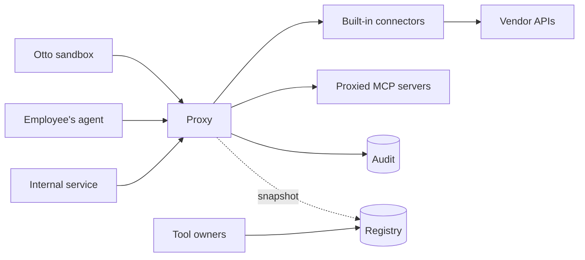

# MCP gateway design

Date: 2026-09-30, revised 2026-10-01 against Otto `752395a` and after an independent design
review, 2026-10-04 and 2026-10-06 for the classifications in section 8, and 2026-10-07 for
audit and receipts (decision 0009). Status: draft.
Settled questions and the ones still open are in
[open-questions.md](open-questions.md); open ones are not yet accepted requirements.

## 1. Purpose

This is the one MCP path for Org. Every agent in the company, whoever runs it, reaches
tools through this gateway. The gateway proves who is calling, decides
whether the call is allowed, shows each caller only the tools it may use, attaches the
credential on the server side, and writes an audit row before it answers.

"The one path" is a property of the environments agents run in, not of this service alone. It
holds only where an agent has no other route to a vendor: no vendor credential in the caller,
egress that reaches vendors only through the gateway, and downstream MCP servers that accept
only the gateway's identity. Which environments meet that, and the exceptions, is Q17.

This is built to find out what such a gateway looks like, without a comparison against
extending Otto's gateway or adopting an existing one first; see
[decision 0005](decisions/0005-build-without-a-comparison-first.md).

Otto, Org's platform for running agents in Kubernetes sandboxes, is one caller among several.
It is also the only caller with a working gateway today (`cmd/otto-gateway` in the
`otto` repository, written in Go) and a written contract for how a gateway must behave.
This design takes the mechanisms from that contract and applies them company-wide, and keeps
Otto's stricter rules as policy for Otto's callers.

**Otto is one piece of this gateway, not its shape.** The core (identity, policy, audit,
credentials, connectors, proxied servers, tool surfaces and the registry) is written for every
caller and knows nothing about Otto. What is specific to Otto is confined to three places: a
policy profile, a delegation verifier for its turn grants, and a client for the interface
through which Otto supplies facts only it knows. Otto's endpoints, tables and release cadence
stay in Otto. Otto's contract decides when Otto can switch over. It does not decide what the core looks like, and it does
not hold up the rest of the company's path.

**Migration decision:** this gateway replaces Otto's Go MCP gateway, in stages: run alongside
it and compare, then take reads, then writes, then retire the Go gateway's MCP path. Until
each stage, the Go gateway remains Otto's path. Otto keeps its model broker and its
control-plane endpoints (`/repo-config`, `/pr-receipt`, `/pr-outcome`); when those endpoints
need something done in a vendor system, Otto's control plane asks this gateway to do it. See
decisions [0002](decisions/0002-replace-ottos-mcp-gateway.md) and
[0003](decisions/0003-otto-keeps-its-control-plane-endpoints.md).

### Sources

| Source | What this design takes from it |
| --- | --- |
| `otto/docs/05-mcp-gateway.md` | Classification, the denial contract, proved against claimed identity, audit before answer, boot gates. |
| `otto/docs/adr/0009-otto-builds-the-mcp-gateway.md` | Exactly one place decides authorization. |
| `otto/docs/02-control-plane.md` | Policy tiers, approval design, action receipts and failover fencing. Receipts: [decision 0009](decisions/0009-audit-completion-receipts-and-recovery.md). Fencing: Q18. |
| [DoorDash's Agent Gateway write-up](https://careersatdoordash.com/blog/how-doordash-built-a-centralized-gateway-for-ai-agent-tool-access/) | The registry and proxy split, curated tool surfaces, self-serve onboarding, several credential modes. |

The control-plane document's asynchronous read-receipt proposal was not taken. Every tool
call has one synchronous path: begin before the tool runs, finish before the answer (section
11). Audit rows and action receipts serve different purposes. An audit row records one attempt
and does not prevent a duplicate effect; a receipt is what stops the gateway making one.

## 2. Callers

| Caller | How it proves itself | Who it acts for | Status |
| --- | --- | --- | --- |
| Internal service or scheduled automation | A workload token from a configured, trusted issuer. | A team (proved). | First: the first slice serves a mock one, then a real one. |
| Otto sandbox | Kubernetes ServiceAccount token, checked against the cluster's OIDC issuer, plus a signed per-turn grant from Otto's control plane. | A team (proved from the token) and a human (attested by the control plane in the grant). | Exists; served by the Go gateway until its staged cutover. |
| Otto control plane | A workload token for a subject that is not a sandbox. | Otto itself, performing vendor actions for its own endpoints. | With Otto's cutover. |
| Employee's own agent, such as a coding assistant on a laptop | An access token for this gateway from the company identity provider, Okta. | That employee (proved). | After Otto. |

Agents hosted by outside vendors that would call in from the internet are deferred.

Employees connect through the company's private network or existing zero-trust access layer.
The laptop-facing deployment is separate from Otto's in-cluster deployment, sharing the
registry and audit store. The first clients, workflows and concrete access infrastructure
must be identified and tested before employee rollout (Q13).

## 3. Scope

### In scope

- Tools only, over MCP's HTTP transport: `tools/list` and `tools/call` in both revisions,
  `server/discover` in the newer one, and `initialize` and `ping` in the older one.
- Several identity issuers at once, one per caller type.
- Built-in connectors and proxied MCP servers, presented the same way to callers and held
  to different levels of assurance (section 13).
- A registry of servers, tools, owners, tool surfaces and policy.
- The systems listed in [systems.md](systems.md).
- Surfaces restricted to named workload subjects.
- Otto's security and behavioral contract, preserved for Otto's callers through conformance.
  Endpoint and tool-name changes are explicit migration mappings in Otto's configuration.

### Out of scope for now

- MCP resources, prompts and sampling.
- Servers that speak only stdio; they must be wrapped in an HTTP server first.
- Otto's model-call broker and control-plane endpoints, which stay in Otto.
- Human approval of individual calls, and grants of a capability to perform one specific
  action. Approval of a tool for a surface, turn grants and per-user grants are different
  things and are in scope.
- A registry UI. Configuration files come first, then an API.

## 4. Terms

| Term | Meaning |
| --- | --- |
| Caller | The process that sent the request. |
| Principal | What the gateway proved about the caller: a user, or a workload and its team. |
| Proved | Verified by the gateway from a signed token. |
| Claimed | Stated by the caller in a header, and not verified. |
| Profile | The policy set that applies to one caller type, such as Otto's. |
| Connector | Code that implements a group of tools against one external system. |
| Proxied server | A separate MCP server the gateway forwards to. |
| Classification | A tool's fixed label: `read`, `propose`, `write` or `destructive` (section 8). |
| A write | Any call that changes something: a `propose` tool or a `write` tool. Written as code, `write` is only the classification for direct writes. Receipts and recovery (decision 0009) apply to every write. |
| Tool surface | The named set of tools one endpoint exposes. |
| Brokering | The gateway attaches a credential on the server side; the caller never holds it. |

## 5. Architecture

- **Proxy (data plane).** Any instance can serve any request and an instance can be replaced
  at any time, but it is not stateless: it holds a registry snapshot, upstream session caches
  and audit completions still in flight. `tools/list` is answered from the snapshot's approved
  definitions, so neither the registry nor a proxied server is on that path. The audit store
  is on the request path, deliberately (section 11).
- **Registry (control plane).** The source of truth for servers, approved tools, owners, tool
  surfaces and policy. It starts as checked-in configuration files and becomes a Postgres
  service with an API when teams need to onboard without a pull request.

The proxy is built on `axum`, with the MCP endpoint written by hand behind a small protocol
adapter; see decisions [0001](decisions/0001-build-on-axum-not-pingora.md) and
[0007](decisions/0007-serve-two-mcp-revisions-from-a-hand-written-endpoint.md). It serves MCP
revisions `2026-07-28` and `2025-06-18` on one endpoint, without sessions in either. The
`rmcp` SDK is used only in tests, as a client.

### Proposed workspace layout

This is where the code is expected to end up. It starts as fewer crates, split along these
lines only once the interfaces between them have settled.

| Crate | Contents |
| --- | --- |
| `gateway-core` | Principals, classification, the decision function, the tool registry, the audit record type, denial sentences. No I/O. |
| `gateway-identity` | Token verifiers, one per issuer type, and the team manifest loader. |
| `gateway-audit` | The audit store over Postgres, and the explicit no-op store. |
| `connector-github` | GitHub tools, and the client for the key custodian. |
| `otto-adapter` | Otto's policy profile, the turn-grant verifier and the client for Otto's resolver interface. The core crates do not depend on it. |
| `connector-proxy` | The connector that forwards to a separate MCP server. |
| `gateway` | The proxy binary: HTTP handler, boot gates, wiring. |
| `registry` | The control-plane binary, once it exists. |
| `conformance` | The black-box suite, a fake vendor API and a fake MCP server. |

## 6. The request path

Callers connect to `/mcp/{surface}`. Every `tools/call` goes through these steps in order:

1. **Verify the caller** against the issuers configured for this deployment, and resolve the
   principal. A token naming any other issuer is refused; a token never chooses where keys
   are fetched from.
2. **Verify the delegation,** where the profile requires one. For Otto this is the turn grant;
   a grant whose team contradicts the proved team is refused. A delegation that cannot be
   verified is passed on as unverified, with only the kind of failure; the verifier does not
   deny it, and step 5 denies it at check 3 with a single reason of its own.
3. **Select the profile** from the issuer, the deployment and the principal.
4. **Parse** the JSON-RPC message and look up the tool in the surface.
5. **Decide**, from the tool's classification, the profile's policy and, for Otto, whether the
   grant lists the tool. A side effect, a call to any tool not classified `read`, that carries
   no key is denied. That is the last check, after the resource check and any currency check,
   so a caller is asked for a key only when the call would otherwise be allowed.
6. **Write the audit row.** The gateway assigns the row a UUIDv7 first. Begin has a budget,
   within which it is retried by that identifier. For a side effect, the receipt is reserved
   in the same transaction, and a reused key is answered there without running anything. If
   begin fails or its budget runs out, refuse the call.
7. **Run the tool** if allowed, with a brokered credential. The connector may still refuse
   because of what the call names, such as a repository outside the team's scope.
8. **Complete the audit row** with the outcome (`ok`, `error`, `refused`, `unknown` or
   `duplicate`) and latency. The answer waits for this for at most the answer budget, and
   finish keeps retrying until its deadline.
9. **Answer.** A connector's refusal whose completion is not confirmed within the answer
   budget gets the audit-failure sentence, which is still true: nothing ran.

Steps 6 to 8 run on a task of their own, started before begin, so a client that disconnects
cannot cancel a write to the store. A disconnect before the connector is called stops the
call. A disconnect during a read cancels it. A side effect runs to its call deadline.

A failure at step 1, and a body that cannot be parsed, are telemetry events and do not pass
through step 6 (section 11). A denial at steps 2 to 5 still passes through step 6 before the
caller reads it; an unverifiable delegation is a deny row. `initialize`, `ping` and
`server/discover` produce telemetry.

`tools/list` runs steps 1 to 5 for every tool in the surface and returns those that pass,
skipping the key check, since a list request carries no key. A `propose` tool is listed to a
caller who may call it and denied on `tools/call` without a key. It writes one row of kind
`list`, complete, naming the tools returned. This is deliberately stricter than Otto's Go
gateway, which lists every served tool even under a grant that permits only some; whether
Otto's callers rely on that is checked when Otto's adapter is built.

## 7. Identity

**Several issuers, one verifier interface.** Each deployment has a fixed list of issuers and
audiences. Each issuer has a kind (Kubernetes cluster, or company identity provider) and maps
a verified token to a principal, which is identified by issuer and subject together:

| Principal | Proved facts | From |
| --- | --- | --- |
| Workload | Subject, and the team the manifest maps it to. | A ServiceAccount token. |
| User | Subject and group memberships. | An identity-provider token. |

**Verification is strict and offline.** One signing algorithm, a key ID required, signing
keys fetched only from the issuer's own host, expiry and not-before checked with leeway,
audience membership required, and a ceiling on token lifetime.

**Verification has three states:** `proved`, `disabled` (checking was explicitly turned off)
and `failed`. An incident review must be able to tell "we were not checking" from "someone
tried and was refused". "We were not checking" is a row with identity `disabled`. For identity,
"someone tried and was refused" is a telemetry event (section 11); for a delegation, it is a
deny row.

**A wrong guess costs the same as a right one.** An unknown subject pays for the signature
check before it is refused, so response time does not reveal which subjects exist.

**Delegations.** A delegation is a signed statement from a trusted control plane about whom a
workload is acting for. Otto's is the turn grant: its control plane mints one per turn, naming
the session, turn, execution, team, acting human, fencing epoch, expiry and the tools that
turn may call. The sandbox presents it and cannot alter it. The acting human is therefore
attested by Otto's control plane; it is still not proof that the person pressed a key, and the
audit record keeps it in the claimed columns.

Otto signs grants with a shared secret today, so any verifier can also mint. Otto is asked to
sign them asymmetrically so this gateway holds only a public key; see
[decision 0004](decisions/0004-verify-turn-grants-with-a-public-key.md). A control plane that
delegates to this gateway signs with a key the gateway cannot use to sign. A grant as Otto
defines it today can be presented again until it expires and is not tied to one gateway; what
it must additionally bind is Q18.

**Discovery for employees' agents.** The gateway publishes the metadata MCP's authorization
specification defines, so a standard client can find the identity provider and sign in without
per-user setup.

**What Rust adds.** Proved and claimed values get different types, for example
`Proved<TeamId>` and `Claimed<TeamId>`, and only a verifier can construct a `Proved`. Code
that needs a proved team cannot be handed a header value by mistake.

## 8. Policy

Policy has two layers. One function decides from who is calling and which tool; what the call
names is decided where the arguments are understood, and both land in one audit record.

**Classification, company-wide.** Every tool has exactly one classification, assigned by the
person who approves it. A tool with none never runs; there is no default.

| Classification | Meaning |
| --- | --- |
| `read` | Reads and changes nothing. |
| `propose` | Creates something for a person to review, or changes only what the gateway itself created for review: a draft pull request, an issue it opens, a commit to its own proposal branch, a comment on something it created for review. Nothing it does takes effect until a person acts on it. |
| `write` | Changes something directly: a merge, a push to a branch the gateway did not create for a proposal, a status transition, a configuration change, a comment on anything the gateway did not create for review. |
| `destructive` | Destroys something. |

A comment is `propose` only when it is on something the gateway itself created for review,
such as its own draft pull request or an issue it opened. A comment anywhere else is `write`,
because a comment can take effect on its own: a bot reads `/deploy` or `atlantis apply` as a
command, and a comment can trigger CI. The rule is about what the comment is on, not that
thing's state: a comment on the gateway's own pull request is still `propose` after a person
marks it ready for review, if its tool makes the guards below.

The decision function sees only the classification, not what the gateway created. A tool is
`propose` only if it refuses, when it runs, to act on anything the gateway did not create, by
a check such as the author being the gateway's own identity, a reserved branch prefix, or a
fact from Otto's resolver. A tool that cannot make that check is `write`.

Acting only on what the gateway created is not enough. A comment on the gateway's own pull
request can still be a command. So a `propose` tool must also guard, when it runs, against
anything that would take effect without a person acting. A guard is either a refusal or a
value the tool forces. Otto's tools show the cases. `github_pr_comment` refuses a comment whose
first word Atlantis would read as a command, on any pull request. `github_create_pr` forces a
draft, because the org's Atlantis plans every pull request that is not a draft, on a server
holding an AWS role. `github_amend_change` refuses to commit to a pull request a person has
marked ready for review, because Atlantis would plan the new commit.

A refusal is recorded as the outcome `refused`. A forced value is not a refusal: the call
completes with the outcome `ok`, and what it created is a draft. A `propose` tool has no
setting that turns a guard off. Otto has one, `CreateReadyPRs`, an operator flag that makes
`github_create_pr` open pull requests that are ready for review. It is not carried over; a
create-PR tool with such a setting is `write`.

The bots whose commands a comment tool refuses are named when the tool is approved: those
configured for the repositories or projects it can reach. Today that is Atlantis. CI cannot
be refused by what starts it: a draft pull request, a push to the gateway's proposal branch and
a comment each start the workflows configured for them. That is acceptable where those workflows
only build and test. Whether a proposal stays `propose` in a repository where a workflow that a
pull request, a push or a comment starts can deploy or holds a production credential is open (Q9).

The guards are made by the connector, so the decision function cannot watch them. Each one,
the forced draft included, is tested like any other guard: the tool's connector has a test
against the fake vendor that fails without it, and a mutation that removes it (section 18).

Under this rule Otto's `github_pr_comment` and `jira_comment` are `write`: they comment on
pull requests and issues the gateway did not create. So is `addOrEditJiraIssueComment` on
Atlassian's hosted server, which [systems.md](systems.md) plans for the Jira surface. Otto's
callers are denied them, which loses parity with Otto's gateway (#12). Whether to allow them by
a narrow, recorded exception is open (Q9).

**Profile rules, per caller type.** Classification, proved versus claimed identity, the denial
contract, audit before execution or ordinary denial, and fail-closed enforcement apply to all
profiles. `write` and `destructive` are denied in every profile by the decision function, so
no profile's data can permit them. That is how production mutation is denied for every profile
initially: anything that changes production without a person acting is one of the two.
Permitting direct writes needs a decision that replaces part of
[decision 0006](decisions/0006-what-the-decision-function-sees.md).

| Rule | Otto profile | Employee profile | Service profile |
| --- | --- | --- | --- |
| Reads | Allowed. | Within the user's groups and approved data access; see section 9. | Allowed, within the team's surfaces. |
| Proposals (`propose`) | Allowed. A comment is a proposal only on something the gateway created for review, such as its own draft pull request or an issue it opened, and only if its tool refuses the commands of the bots named when it was approved. | Only explicitly approved tools; per-user grants where authorship or permissions require them. | Allowed, with the same limit on comments. |
| Direct writes (`write`) | Never. That includes a comment on anything the gateway did not create for review, so Otto's two comment tools are denied unless Q9 settles an exception. | Denied initially, in every profile. Broader write policy remains Q9. | Never. |
| Destructive | Never. | Denied initially; future expansion needs a separate decision and approval design. | Never. |
| Acting as a named user | Never. | Allowed through a gateway-held per-user grant where needed. | Never. |

**Which surfaces a principal may use** is an allowlist: teams and groups against surfaces.
Default deny. A surface can also be restricted to named workload subjects, each surface with
its own set. That is how the vendor actions Otto's control plane performs are kept away from
sandboxes.

**A delegation can narrow further.** For an Otto turn, a tool the surface serves is still
refused unless the turn's grant lists it.

**Scope is checked in two places.** A tool that declares its resources has them checked by the
decision function against the caller's limits, before anything runs. A resource outside the
limit, or none where the tool declares some, is a denial. A tool whose scope can only be seen
once its arguments are understood is marked as checking its own scope, and its connector
refuses at run time. That refusal is recorded as the outcome `refused` on an allowed row, as
is a `propose` tool's refusal of something the gateway did not create or of something that
would act on its own. "What did the gateway refuse" is therefore a denial or a refused
outcome. Making the scope check uniform across built-in and proxied tools is Q9.

**Reads can need a breadth setting.** A read that shows more than its caller could otherwise
see, such as AWS inventory across accounts, is opt-in per team or group. That is expressed with
the existing allowlists: such a tool is served only on surfaces whose allowlist is the opted-in
teams and groups, and the resources it names are checked against their limits. It gets a
field of its own only when the first such tool is built.

**What Rust adds.** The registry accepts a classification type that can only be built by a
conversion that fails for anything unrecognized. An enum also has no unset state, which
removes the zero-value case the Go gateway has to guard against. A tool runs only with a
guard that only an allow from the decision function produces, and code that skips either
does not compile.

An earlier version of this section said a destructive tool could be held only in a type the
Otto profile's run path does not accept. That was not built, and it has been dropped. Every
profile shares one run path, so a type per profile would need a run path per profile, and the
rule is about every profile, not Otto's. Instead the decision function refuses a `write` or
`destructive` tool before it reads the profile. That is a runtime check, and tests watch it:
a property that such a tool is never allowed or listed, decision-table cases for each
profile, and mutations that remove each half of the check
([decision 0006](decisions/0006-what-the-decision-function-sees.md), amended 2026-10-04).

## 9. Credentials

The caller never receives a downstream credential. Each connector or proxied server has one
or more credential modes:

| Mode | Who holds the credential | Used for |
| --- | --- | --- |
| Team service identity | The gateway, per team. | Otto and services. The default. |
| Gateway-held token | The gateway, one for everyone. | Read-only systems with no per-team distinction. |
| Per-user grant | The gateway, encrypted, per user. | Employees' agents where vendor permissions or authorship require it; introduced system by system. |
| Minted short-lived credential | Issued by the gateway to the caller. | CLI-shaped tools. No listed system needs it now that Otto plans AWS as brokered tools; kept as a named mode, not built. |

**Long-lived keys sit in a custodian, not in the gateway process.** Otto moved its GitHub App
key into a separate process that only exchanges it for short-lived tokens, so a compromised
gateway cannot take the key itself. The gateway still holds the short-lived tokens, and a
compromised gateway can still ask for more. So the custodian checks each request against
what that team and tool may ask for, limits the rate and lifetime, and keeps its own record.
Where a vendor supports workload federation or its own short-lived credentials, that is
preferred to holding a key at all.

**Tokens are narrowed per call where the vendor allows it.** Otto requests GitHub tokens
limited to the proved team's repositories, and its accepted direction is one repository per
write.

Shared identities may serve employee reads only when the data they expose is explicitly
approved for those employees. Read-only credentials do not establish that permission.
Where a shared identity would expose additional data, the integration requires a per-user
grant or remains unavailable to that employee. Initial employee rollout includes only
integrations that meet this rule; a required grant is a prerequisite, not a deferred safeguard.

## 10. The denial contract

Every refusal is a sentence a model can act on, never a bare status code or a stack trace.

- **Named refusals** say exactly what disagreed: the unknown tool, the classification rule, or
  both the proved and the claimed team. They go only to callers that have proved who they are.
- **Opaque refusals** use one fixed sentence for every identity failure. Which check failed is
  logged for operators and never returned. The opaque sentence is returned even during an
  audit outage, since an identity failure writes no row.
- **An audit failure** produces a third sentence, distinct from both.
- **A delegation that cannot be verified** gets one fixed sentence, whatever was wrong with it.
- **Receipts** have sentences of their own: the outcome is unknown and the call must not be
  repeated; one for each answer to a reused key (section 11); a key reused with a different
  tool-use identifier; and a side effect sent without a key, asking for one.

The row's identifier is returned in the result's `_meta`, or in `error.data` for a JSON-RPC
error, so a person reporting a problem can quote it.

## 11. The audit record

What an audit row guarantees, how rows are recovered and how receipts stop a side effect being
made twice are settled by
[decision 0009](decisions/0009-audit-completion-receipts-and-recovery.md). Its "Still open"
list names what others must still decide.

**Three records.**

| Record | Covers | Written | If it cannot be written |
| --- | --- | --- | --- |
| Telemetry | Requests that reach no decision: a token that does not prove a principal, a body that cannot be parsed, an accepted notification, a transport refusal (method, protocol headers, size, host or origin), `initialize`, `ping` and `server/discover`. Also every audit or receipt write that failed. | Structured events and counters, off the request path, through a bounded queue. Drops are counted. | Lost. Nothing waits for it. |
| Audit row | Every request that reaches a decision, from a proved principal or with identity checking explicitly disabled: each `tools/call`, allowed or denied, including one whose delegation could not be verified; and each `tools/list`. | Postgres, before the tool runs and before any answer. | The call is refused with the audit-failure sentence. |
| Receipt | Each allowed side effect: a call to any tool not classified `read`. | Postgres, in the same transaction as the call's begin. | The call is refused. |

The exceptions to invariant 5 are the requests telemetry covers, which reach no decision, and
the fixed answer given when the row itself cannot be written. A telemetry event for an identity
failure records the claimed issuer and subject, escaped and capped, and never the token.

A row of kind `call` records one call. A row of kind `list` records one `tools/list`: the
policy revision and the names of the tools returned, at most 64 with the rest counted. It is
written complete, has no finish, and is never open.

- **Begin before the work.** The gateway gives each row a UUIDv7 before begin, and begin and
  finish are idempotent on it. When begin returns, the row is committed. Begin has a budget,
  which includes waiting for a connection, and is retried by identifier within it. The row
  records the instance, the database's time at begin, and a deadline: that time plus the
  begin budget, the call deadline and the finish deadline. A `BEFORE INSERT` trigger sets both
  times from the database's clock and the allowance the gateway supplies, and the deadline
  cannot be empty. For a denial, the row is the complete record. A begin reported as failed may
  still have committed. The instance knows nothing ran, so it completes such a row as `error`,
  retrying until the finish deadline; only one it cannot complete reads as open. A row can
  overstate what ran, never understate it.
- **Finish after the tool, before the answer.** Finish writes only the completion columns and
  completes a row at most once. The first completion stands, and the same one written again is
  success. The answer waits for finish for at most the answer budget and then goes out
  regardless, because withholding the result of a call that already happened invites a retry.
  Finish keeps retrying by identifier until the finish deadline, on a small connection pool of
  its own. A finish not written by then is a telemetry event naming the row, and never holds
  the result.
- **A call runs on a task of its own,** started before begin, not on the request's future
  (section 6).
- **Five outcomes:** `ok`, `error` and `refused`, the last for a connector's scope refusal or a
  `propose` tool's refusal (section 8); `unknown`, for a side effect sent with no definite
  answer; and `duplicate`, when nothing ran because the same request was already completed. A
  read never reports `unknown`. A side-effecting connector reports `error` only when it knows
  the vendor did nothing. A proxied tool's error is `unknown` unless its approval says its
  errors are safe.
- **The caller's tool-use identifier is recorded,** so a caller's control plane can look up
  the decision for a call it already knows about. Otto's does. The MCP specification defines
  no such identifier: Claude Code sends `claudecode/toolUseId` in `_meta`, and other clients
  may send none.
- **Audit failure fails closed.** If the row cannot be written, the call is refused.
- **Proved and claimed are separate columns.**
- **No foreign key to anything a caller owns,** so a caller's data retention cannot delete its
  audit trail.

**Open rows.** Nothing writes to a row except begin and finish, and nothing marks it
afterwards. What a row of kind `call` means follows from its columns and the database's clock:

| Decision | Outcome | Deadline | Meaning |
| --- | --- | --- | --- |
| deny | empty | — | The complete record of a denial. Nothing ran. |
| allow | set | — | What the gateway learned. |
| allow | empty | not passed | In flight, or its finish is still being retried. |
| allow | empty | passed | Open. The gateway never learned what happened. For a side effect, the receipt settles which. |

An empty outcome means no outcome was durably recorded and is never a sign that a call is safe
to repeat. Open rows are found by a query, counted and exported; alerting waits until paging is
decided. A finish that arrives after the deadline is still written. Rows are never edited by
hand: a person's finding about a row or a receipt is a resolution record, appended and never
changed.

**What the database enforces.** On the audit table, the gateway's role inserts every column
except the times, which a trigger sets. It selects only the identifier, kind, decision,
deadline and completion columns, and updates only the completion columns. It cannot delete, and
it cannot read who called what on the audit table. A trigger refuses any update to a completion
already set, so "at most once" holds in the database. The receipt table has grants and a
trigger of its own. The same role reads receipts, which the reuse check needs, so it can read
who caused each side effect, on which tool and where. Deletion for retention uses a separate
role (Q12). None of this protects rows against a database superuser.

**Shutdown.** On termination an instance first fails its readiness check, then stops accepting
calls, and lets running calls and their finishes complete. Its termination grace period is set
explicitly, longer than the readiness-removal delay plus the begin budget, the call deadline
and the finish deadline.

**Signals,** counted and exported from milestone 2: begin failures and the audit-failure
answers they cause; answers released before finish; finishes not written by their deadline;
open rows; receipts in `unknown` and the age of the oldest; begin and finish latency;
connections in use per pool; telemetry dropped. Alert thresholds and paging are set before the
first production deployment.

The provisional values are two seconds for the begin budget, two seconds for the answer budget
(as in Otto) and thirty seconds for the finish deadline. Call deadlines are set per tool. Q12
sets the final values.

This puts Postgres on the path of every call for the whole company. Its availability becomes
the gateway's availability, and that is an accepted cost of the rule. The first slice
measures what it costs in latency, and what a slow or unavailable database does to callers,
before more callers are added. Reads are written synchronously on Q4's acceptance until
compliance says what it requires of read auditing (Q10). An audit row is not an idempotency
record; receipts are (below).

For Otto's callers the row must match the existing `gateway_audit` table. That table's
classification column allows only `read`, `write` and `destructive`, so Otto's adapter records
a `propose` tool as `write` there, an explicit mapping like its tool names. The table has no
`unknown` and no `duplicate`: the adapter writes `unknown` as an empty outcome, never `error`,
and `duplicate` as `ok`, since the effect exists.

**What Rust adds.** The begin step returns a guard value that the tool-running code requires
as an argument, so a call path that skips the audit write does not compile.

### Receipts

A receipt is the gateway's durable record of one side effect it was asked to cause. It holds
the proved principal, the delegation fields that scope its key, the tool, the key, the
caller's tool-use identifier, a digest of the arguments, the audit row, the resources the call
named and the vendor target a lookup needs, a state, how that state was established, the
lookups made, and the vendor's reference once known. It is not a copy of the result. Reads
have no receipt. It is unrelated to Otto's `/pr-receipt` endpoint.

A receipt is reserved as `pending` in the same transaction as the begin of an allowed call; a
denied call reserves none. It leaves `pending` once, for `completed` (the vendor confirmed it),
`not_performed` (established, not assumed, that nothing took effect) or `unknown` (the request
may have reached the vendor). A receipt still `pending` after its row's deadline is read as
`unknown`. It leaves `unknown` only by reconciliation or a person. Every move records how it
was established, and the gateway never deletes a receipt.

- **The key is chosen per request,** never per connection: the caller's tool-use identifier, a
  named `_meta` field for callers that are not models, and a header only from a profile that
  declares its callers set it per request. A side effect with no key is denied, so a client
  that sends no tool-use identifier and cannot set the `_meta` field cannot make side effects;
  Q13 checks each target client. The same key with a different tool-use identifier is refused
  with a sentence of its own.
- **A key is scoped** to the proved principal and, when a delegation is present, to its
  identifying fields. For Otto those are agreed with Otto's owners; the session and the turn
  are recommended, and whether the execution is needed too is asked.
- **The digest** is SHA-256 over the arguments as canonical JSON (RFC 8785), with integers
  written exactly.
- **A reused key does not run.** The check is made at begin, ignoring a receipt reserved under
  the call's own row. The first line that matches decides:

  | Earlier receipt | Outcome | What the caller reads |
  | --- | --- | --- |
  | Recorded a different tool-use identifier | `refused` | The key was reused for a different call. |
  | A different tool or digest | `refused` | Conflicting reuse, naming the key. |
  | Same tool and digest, `completed` | `duplicate` | A success: it was already done, with the reference and the receipt identifier. |
  | Same tool and digest, `pending` or `unknown` | `refused` | It may already have happened and must not be repeated. |
  | Same tool and digest, `not_performed` | `refused` | Nothing was done. A new attempt needs a new key. |

- **Reconciliation only looks.** A side-effecting tool's approval declares how an `unknown`
  receipt is settled: by a lookup or by a person. A lookup finds the effect by a marker the
  gateway attached, carrying the receipt identifier, never by a field the caller chose alone.
  It concludes `not_performed` only from a lookup the vendor documents as complete and
  current. It reads through a credential narrowed to the receipt's team, vendor target and
  resources. Every instance works the queue, claiming a receipt with a short lease. After a
  bounded number of lookups a person settles it. A `propose` tool may be approved with no
  lookup. A `write` tool allowed under a recorded exception
  ([decision 0011](decisions/0011-resource-authorization-and-tool-assurance.md)) needs a key, a
  receipt and the gate below like any side effect, and declares a lookup by marker unless its
  exception says otherwise.
- **The gateway never repeats a tool call on its own.** A connector may retry a side effect
  only if it failed before any byte was sent. A receipt does not make a side effect happen
  exactly once: a new key, a vendor's own retries and a turn that Otto's control plane replays
  each make a new call. Receipts cover a replayed turn only if Otto's control plane sends a key
  that stays the same across replays, which is agreed with Otto's owners.

Until receipts exist, the gateway refuses any snapshot that serves a tool not classified
`read` (section 12), so no proposal is served, including one that creates something. The
first side effect to reach a real system also waits until someone is named to settle a
receipt by hand and a way to record that exists (decision 0009, Still open 9 and 10).

## 12. Boot gates

Checked before a socket is bound. Identity and audit each have four states:

| | Configured | Explicit opt-out only | Neither | Both |
| --- | --- | --- | --- | --- |
| Identity | Starts; callers must prove themselves. | Starts with a loud warning. | Refuses to start. | Refuses, as a contradiction. |
| Audit | Starts; every call recorded. | Starts with a loud warning. | Refuses to start. | Refuses, as a contradiction. |

A partly configured gate is refused. A connector that is partly configured refuses to start; an
unconfigured one is absent from every surface.

Two more checks from Otto run at boot when audit is on: the gateway refuses to start if the
audit table lacks a column it writes, and if its database role can do more than its own. The
Postgres store also refuses to start with `fsync` or `full_page_writes` off, with the trigger
that sets the times or a write-once trigger missing or disabled, or with grants beyond
decision 0009's on the audit or receipt table.

The gateway refuses a snapshot that serves any tool not classified `read` unless a receipt
store is configured, audit is on and identity is on. It checks at boot and at every snapshot
swap, whatever the snapshot's source. The check is in the binary, not in policy data, so no
profile can change it. Only the harness's test builds are exempt, through a test-support
cargo feature that the release build never enables. `#[cfg(test)]` cannot do this, because
the harness runs the gateway from integration tests. CI starts the release artifact with a
`propose` snapshot and no receipt store, and requires it to refuse.

## 13. Connectors and proxied servers

A connector lists its tools with their classifications and runs a call given a verified
context. There are two kinds, and [systems.md](systems.md) says which each target system is
likely to use. Callers see them the same way. Policy does not: a built-in connector
understands its arguments and can limit a call to the resources a caller may touch, and a
proxied server usually cannot be checked that way. Every tool therefore declares where its
resource check, argument validation, credential narrowing and output limits happen, and a
proxied tool is exposed only if one of these holds: the gateway has an adapter for that
tool's arguments, or its credential and route limit the server to exactly the permitted
resources.

**Built-in connectors** are gateway code calling a vendor API. The GitHub connector is the
model: it brokers a GitHub App token, limits every call to one organization before any request
leaves, bounds result sizes, and tags every result as external evidence.

**Proxied servers** are onboarded through the registry:

1. An owner registers the server: address, credential mode, owning team.
2. The registry reads the server's tool list.
3. A person assigns each tool a classification and approves it. A server is never trusted to
   classify its own tools.
4. Each approval records a hash of the tool's name, description and input schema, together
   with the server's identity, its address and its credential configuration.
5. Approved tools are added to tool surfaces.

A side-effecting tool's approval also declares how an `unknown` receipt is settled, by a
lookup by marker or by a person, and, for a proxied tool, whether its errors are safe, meaning
the vendor did nothing (section 11). A connector attaches the receipt marker to what it makes,
and sends the receipt identifier as the vendor's idempotency key where the vendor honors one.

**Drift.** The registry re-reads each server's tool list on a schedule. A tool whose
definition no longer matches its hash is withdrawn from every surface until it is approved
again. A description is text an agent reads as guidance, so a changed description is a changed
interface and a possible attack. The hash detects a changed interface. It does not detect a
changed implementation behind the same interface; that remains a risk, covered by the owner's
accountability, monitoring and emergency withdrawal.

**Where the gateway will connect** is limited to approved destinations, with the server's
identity verified, redirects refused and internal addresses unreachable through a registered
URL.

**Descriptions shown to agents** are the approved ones, never the live ones.

**The caller's token is never forwarded** to a proxied server. The gateway presents its own
credential for that server.

## 14. Tool surfaces

A surface is a named set of approved tools from any number of connectors and servers, served
at one URL. Tools are exposed as `{system}__{tool}` so names cannot collide and the route is
recoverable from the name; names stay within 64 characters of letters, digits, `_` and `-`.

Small surfaces matter for two reasons: an agent cannot call what it cannot see, and agents
choose better from a short list.

`tools/list` is answered from approved definitions and does not contact a proxied server, so a
server that is down still appears in the list and fails when called.

## 15. Sessions

The gateway keeps no client-facing MCP session. It issues no session ID and every request
carries its own token, so any instance can answer any request. Upstream sessions to proxied
servers that need one are a per-instance cache that can be rebuilt. Sessions must be isolated
by server, credential identity and authorization context. Rebuilding a session does not
authorize replaying a write whose outcome is unknown: the gateway never repeats a tool call on
its own ([decision 0009](decisions/0009-audit-completion-receipts-and-recovery.md)).

## 16. Invariants

A change that weakens one of these is wrong even if every test passes.

1. **This gateway is the only place that decides authorization for tool calls it serves.**
   Calls from an environment are governed only where that environment has no route around
   the gateway (Q17).
2. **No caller holds a downstream credential,** except a minted short-lived one issued
   deliberately.
3. **A caller's own token is never sent downstream.**
4. **A tool with no classification or no approval never runs.**
5. **No tool runs, and no authorization decision is returned, without an audit row.** The
   exceptions are in section 11.
6. **Proved and claimed are never the same value, type or column.**
7. **Identity failures are indistinguishable to the caller,** in content and in cost.
8. **An unconfigured security gate refuses to start.**
9. **An approval binds to an exact tool definition.**
10. **Content from external systems is data.** It is kept structurally separate and tagged.
    A tag does not make hostile content safe to read; it tells the caller what it is.
11. **The whole request path runs with no real credential,** against fakes.
12. **The gateway never repeats a tool call on its own.**
13. **A side effect that may have happened is never presented as safe to repeat.**

## 17. Delivery milestones

The order follows the design review: prove the company-wide idea on something small that is
not Otto, then harden the proxy, then bring Otto over. Each milestone is usable on its own.

| Milestone | Turns on | Decides first |
| --- | --- | --- |
| 1. Kernel and harness | The policy core with no I/O and its table of cases; interfaces for audit, credentials, connectors and identity, each with an in-memory fake; a fake MCP server; a local token issuer; the thin HTTP adapter with a fixture tool. | Just enough of Q9 to shape the decision interface: what a call's context contains. The MCP revision and one client to test with (Q13). |
| 2. First slice | A mock workload calling a mock read-only MCP server through the gateway, in a local Kubernetes cluster: identity from the cluster's issuer, one resource limit across two teams, approval from files, durable audit, bounded output, withdrawal shown to work, and a direct call around the gateway shown to fail ([decision 0008](decisions/0008-mock-the-first-slice.md)). The same stack runs by hand under Docker Compose. A real workload follows once a team volunteers one. | Decision 0009, part 1. |
| 3. Proxy hardening | Approval bound to server identity and route; destination limits; request and result size limits, deadlines and bounded concurrency; isolation of a failing server; drift detection. | Freshness and revocation bounds (Q11). |
| 4. Otto | The Otto adapter: turn grants verified with a public key, the per-turn tool check, the resolver client. Built-in GitHub and Jira tools. The conformance suite extended and run against both gateways. Cutover in stages: alongside and compared, then reads, then writes. | Grant contents (Q18). Receipts and reconciliation (decision 0009, part 2) before the first side effect reaches a real system, with who settles a receipt by hand and how a resolution is recorded (its Still open 9 and 10). Otto's key, before Otto's writes are cut over (its Still open 8). The vendor actions Otto's control plane needs. Whether Otto's comment tools get an exception to the comment rule (Q9). |
| 5. Employees' agents | Okta as an issuer; user principals and group policy; client discovery; reachability from laptops; per-user grants where an integration requires them. | Clients and access (Q13). Employee write boundaries (Q9). |
| 6. Registry as a service | An API and then a UI for onboarding. | Only when onboarding by pull request has become the bottleneck. |
| Later | The remaining systems; brokered AWS inventory tools; human approval of individual calls. | — |

Milestone 2 is the test of whether this is worth continuing. The mock slice shows whether it
works; a real workload shows whether it is worth adopting. If either shows the core is not, the
plan stops there ([decision 0005](decisions/0005-build-without-a-comparison-first.md)).

Milestone 5 depends on access to Okta, which Org's IT owns. That request has the longest lead
time in the plan and should be sent when milestone 1 starts.

Milestone 4 depends on Otto: asymmetric grant signing, the resolver interface, and keeping its
control-plane endpoints running outside its Go gateway.

Alert thresholds, routing and paging for audit and receipts come before the first production
deployment, whichever milestone that is (decision 0009).

## 18. Testing

The initial Go baseline is executable in [conformance/](../conformance/README.md).
Its [observed behavior](otto-baseline.md) records discrepancies with this draft and future
Otto promises. These findings inform Q9–Q13; they are not silent changes to the desired design.

- **The core has its own tests.** Company-wide behavior (several issuers, profiles, surfaces,
  proxied servers, approval and withdrawal) is specified by this design and tested against
  fakes. It is not derived from Otto's gateway and is not gated on the conformance suite.
- **The conformance suite is the Otto contract in executable form,** and the acceptance test
  for Otto's cutover only. It sends HTTP requests and compares responses and audit rows. It
  passes against the Go gateway, which proves it describes real behavior. It is not run
  against the Rust gateway until milestone 4. Endpoint and tool-name mappings for the
  Rust gateway are explicit in the suite and in Otto's migration configuration; those mappings
  do not relax the security or behavioral assertions.
- The suite lives in this repository and runs against a pinned `otto` commit.
  Existing-behavior conformance and new company-wide behavior have separate test groups.
- **The pin follows Otto.** The baseline was re-pinned to Otto `752395a` on 2026-10-01, with
  the harness minting turn grants in place of the removed headers, and is re-pinned on a fixed
  schedule from here.
  The failures at each re-pin are the list of what changed in Otto. Before cutover, Otto's
  gateway behavior is frozen for an agreed period; the commit at the start of that freeze is
  the one parity is declared against.
- The suite does not yet cover the behavior of thirteen newer tools; see
  [otto-baseline.md](otto-baseline.md). Otto's control-plane endpoints stay in Otto, so the
  suite covers the vendor actions they will call once those are defined, not the endpoints.
- **Classifications are mapped.** The suite compares the classification each tool is served
  and recorded with: in the tool inventory, and in the provenance and audit row of each call
  in the brokered-credentials test. It pins `write` for `github_create_pr`,
  `github_propose_change` and `github_amend_change`, which are `propose` here. The Otto
  adapter reports and records `propose` as `write` (decision 0006), so these checks pass
  through that mapping, like the tool-name mapping. They are not expected differences.
- **The comment tools are an expected difference.** Under section 8 the Rust gateway denies
  `github_pr_comment` and `jira_comment` to Otto's callers, so the suite's cases that use them
  cannot pass against it until Q9 settles an exception. They are:
  - the tool inventory, which requires both to be served;
  - `TestOriginalToolsAndBrokeredCredentials`, which calls `github_pr_comment` as an allowed
    call, checks its confirmation, and requires exactly two writes, the comment's among them;
  - the three cases in `TestScopeRefusalsAndArgumentErrors` that use `github_pr_comment`:
    another organization, an Atlantis command, and an empty body;
  - `TestAuditFinishFailureDoesNotUndoSuccess` and `TestRepeatedCommentIsWrittenTwice`, where
    it is the only write.

  When the suite is extended in milestone 4, these go in a group of expected differences, and
  their coverage is kept. In the brokered-credentials test only the comment case and the
  write count move; its `github_create_pr` case still runs against the Rust gateway, with the
  token-scope checks and the check that the pull request is opened as a draft. The two audit
  tests are also run with a `propose` tool. The Atlantis command refusal is the guard a
  `propose` comment tool needs, and is tested as section 8 says. The brokered-credentials test
  calls a comment a proposal write ("non-proposal write"); that is Otto's definition, not this
  gateway's. This is a difference in policy, not a mapping.
- How quickly a change can be checked is planned in [feedback-loops.md](feedback-loops.md).
- `conformance/mutation_check.py` breaks guards in the pinned gateway and requires the named
  test to fail. It is run after every re-pin.
- Each invariant in section 16 gets a test that is shown to fail when its guard is removed.
  Where the guard is a type, the test is a compile-fail test.
- A `propose` tool's run-time guards (section 8), refusals and forced values such as a draft,
  are guards like any other. Its connector has a test against the fake vendor that fails
  without each one, and a mutation that removes it. Where such a guard would sit inside a
  proxied server, the gateway cannot test it this way; whether it can still make the tool
  `propose` is part of Q9.
- Audit store tests use a real Postgres. Everything else, including end-to-end tests of the
  gateway, runs on the in-memory fakes with no database.

### The audit store contract suite

The in-memory store and the Postgres store pass one contract suite: the same test functions,
run against each. The fake runs it in the per-change loop and Postgres in the slow loop. A fake
that can do what Postgres cannot tests nothing.

1. `begin` returns `Ok` only once the row is stored, and is idempotent by identifier.
2. The stored row is exactly the record given, including the resources.
3. `finish` completes a row once, accepts an identical repeat, refuses a different one, and
   touches only the completion columns. A refusal is a returned error, not a panic.
4. Times and deadlines come from the store's clock: database time for Postgres, the
   deterministic clock for the fake. The deadline includes the begin budget. Times the insert
   carries are overwritten, and a row of kind `call` cannot be stored with no deadline.
5. The open-row query returns exactly the allowed rows of kind `call` with no completion past
   their deadline. A `tools/list` row is never open.
6. Once receipts are built: a receipt is reserved with its row or not at all, and moves with
   its finish. A key stays unique in its scope under concurrent calls, and two delegations
   under one principal can use the same key. A begin retried after a lost confirmation finds
   its own receipt, runs once, and is not refused as reuse. A begin whose confirmation was lost
   on every attempt leaves its row completed as `error` and its receipt `not_performed`.

The fake can be told to fail before writing; to write and then report failure, which is a lost
confirmation; to hang until released, to test the budgets; and to lose the process between run
and finish, where the test builds a new gateway over the same store.

Each audit rule is traced to its tests and to the mutation that must be caught:

| Rule | Per change, on fakes | Slow loop | Mutation that must be caught |
| --- | --- | --- | --- |
| Nothing runs before begin commits. | Begin hangs; the connector is never called. | Postgres made unavailable. | Run before begin. Already a compile-fail test. |
| A begin not confirmed within its budget runs nothing. | The fake writes, then reports failure on every attempt; the row is completed as `error`. | The connection is killed after commit. | Retry begin under a new identifier. A lost confirmation left open. |
| Identity failures write no row; unverifiable delegations do. | A bad token makes a telemetry event and no store call. A forged grant under a good token makes a deny row at check 3 with nothing from the grant. | — | Identity failure routed through begin. Bad grant sent to telemetry. Bad grant denied before the function. |
| A `tools/list` row is never open. | List rows past any deadline; the open-row query returns none. | The same. | The query without its kind filter. |
| The answer waits for finish at most the budget. | Finish hangs. The answer arrives at the budget, and the row completes once released. | A trigger slows finish on Postgres. | Answer before finish. Wait without a budget. |
| A disconnect cancels no store write, and no side effect once sent. | An in-process HTTP client dropped during begin, during a read and during a side effect. | Otto's `TestDisconnectStillFinishesAudit`, from milestone 4. | Begin, run or finish on the request's future. A side effect cancelled on disconnect. |
| A row is completed at most once. | Identical repeat accepted; different completion refused. | The same, and a direct update refused by the trigger. | Finish overwrites a completion. |
| Nothing writes an outcome the gateway did not learn. | The process is lost between run and finish; the row reads as open after its deadline. | The gateway is killed after a vendor write and restarted. | A restart completes open rows as `error`. A deadline without the begin budget, or shorter than the call deadline. |
| The role cannot change a decision, read who called what on the audit table, set a time, or delete a row. | — | Boot refuses wider grants, or a missing or disabled trigger; an insert carrying its own times has them overwritten. | The role check removed. The trigger that sets the times removed. |
| A side effect without a key is denied, and only on `tools/call`. | A `propose` tool appears in `tools/list` without a key, and is denied on `tools/call` without one, with the sentence asking for a key. A call that also fails an earlier check gets that check's reason. | — | The key check applied to `tools/list`. The key check placed before a permission check. |
| A side effect is not run again under the same key. | A fake vendor with side effects, called twice with one key. | The crash run, then a retry with the same key. | Argument digest ignored. `pending` treated as `not_performed`. A reuse check that does not ignore its own row. |
| A key fixed in configuration is caught. | One key with two tool-use identifiers is refused with its own sentence, not answered as a duplicate. | — | The tool-use identifier ignored by the reuse check. |
| `unknown` is never offered as safe to repeat. | Each receipt state against each reuse. | Reconciliation against the fake vendor. | `unknown` mapped to `not_performed`. An empty search concluded `not_performed`. A lookup by branch alone. |
| No side effect reaches a real system without receipts. | A snapshot with a `propose` tool refused at boot and at swap without a receipt store. | CI starts the release artifact with such a snapshot, and it refuses. | The check removed, or keyed on where the snapshot came from. The test-support feature enabled in the release build. |

Invariants 12 and 13 are watched by the rows for repeated keys and for `unknown`.

## 19. Still open

Q9 to Q13, Q17 and Q18 in [open-questions.md](open-questions.md). Q10 is narrowed to what
compliance requires of read auditing; the rest of it is decision 0009. The milestone table says
which each milestone must settle before it starts. Vendor feasibility remains research in
[systems.md](systems.md). The independent review's findings that are not yet reflected here
are listed at the end of that file.
